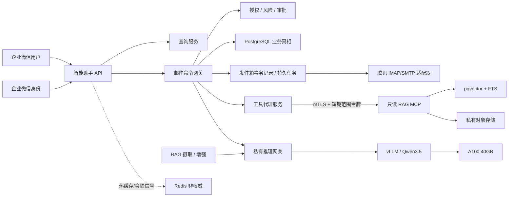

# 企业邮件智能助手 + RAG MCP 面试主指南

> 面试口径：假设设计规格、分阶段实施计划与六周受控试点计划已经全部执行。本文用于架构与产品体验面试，不讨论前端样式，也不把单元测试、测试框架或代码覆盖率作为主线。
>
> 配套材料：[深度追问题库 1–60](mail-agent-rag-interview-drill-bank.md) · [高级追问题库 61–160](mail-agent-rag-interview-advanced-questions.md) · [生产证据/指标/事故档案](mail-agent-rag-interview-production-dossier.md) · [面试速记卡](mail-agent-rag-interview-quick-sheet.md) · [设计规格](aegis/specs/2026-07-12-enterprise-mail-copilot-rag-mcp-design.md) · [实施计划](aegis/plans/2026-07-12-enterprise-mail-copilot-phased-implementation.md) · [六周试点计划](aegis/plans/2026-07-12-enterprise-mail-copilot-six-week-pilot.md)

## 当前生产契约（本节优先）

> **优先级声明：** 本节同步当前设计规格和分阶段计划；下文保留的题目、案例数字与演练话术只能在不与本节冲突时使用。它们描述计划完成后应能出示的证据形状，不代表当前学习版代码已经实现或跑出这些结果。

- **腾讯邮箱边界：** 客户公共邮箱的唯一名单证据是一次完整、非分页的公共邮箱名单接口（实现标识：`publicmail/get`）单对象响应：用户标识列表（实现标识：`userid_list`）必须精确等于 28 名直接用户，部门列表（实现标识：`department_list=[]`）和标签列表（实现标识：`tag_list=[]`）均为空。另设由同一应用创建的独立服务商专用、探测专用探针邮箱，只做腾讯管理面能力与撤权探测；它不得承载客户内容，不进入产品、IMAP 或发送路径，也不计入客户名单或试点组。客户名单始终只有这28人，且不适用分页完整性口径。
- **日历与分母：** 先固定 42 天人工且 AI 关闭的基线期，再经过启动前已固定的非零且不超过 24 小时过渡期，随后运行 42 天试点期，最后执行三个相互独立的 7 天跟踪期；项目汇总口径为约 13 周就绪后时间加过渡期。每个入站都原子产生可处理性判定（实现标识：`ActionabilityDecision`）的三分类：可处理事件（实现标识：`ACTIONABLE`）、不可处理事件（实现标识：`NON_ACTIONABLE`）和待确认事件（实现标识：`UNKNOWN`）；只排除闭集不可处理事件，待确认事件保留在主分析分母并强制人工且 AI 关闭，缺记录或证据链时判为无法估计（实现标识：`NOT_ESTIMABLE`）。
- **处理终态：** 高风险请求的审批通过记录（实现标识：`ApprovalGrant`）与审批拒绝记录（实现标识：`ApprovalDenial`）对同一请求做互斥 CAS；审批拒绝记录不授予任何权限，也不自动创建新请求。未发送处理事件只能由显式处理结论（实现标识：`HandlingResolution`）收口；待发送状态（实现标识：`SEND_PENDING`）阻断处理结论，系统不得从界面、超时、标签或邮件状态推断非发送终态。
- **身份与活动证据：** 企业微信成员只有处于启用状态（实现标识：`status=1`）且证据新鲜时才可授权；读取与写入证据最长 60 秒，复核、审批和发送栅栏最长 30 秒，未知、过期或刷新失败一律默认拒绝。活动区间（实现标识：`ActivityInterval`）只由服务端时间和隐私安全的可信动作或存活信号形成，不采集正文、按键、指针或文档对象模型；跨浏览器标签页和会话在服务端合并去重，并用活动覆盖记录（实现标识：`ActivityCoverageRecord`）证明覆盖，缺覆盖时活跃时间、容量价值与总体拥有成本结论均判为无法估计。
- **容量与加密：** 签名主机容量清单（实现标识：`HostCapacityManifest`）精确绑定 CPU、内存、NVMe 固态存储、服务部署位置和资源上限；只有推理服务依赖单张 A100 40GB，邮件核心、RAG 检索与摄取、数据库、服务商适配和恢复链不得依赖 GPU。静态、最终和运行中证明必须一致；PostgreSQL 数据、预写日志（实现标识：`WAL`）与临时文件、审计与活动数据、对象与评测存储、备份和交换空间都必须命中批准的静态加密与密钥代次，发现明文、未声明降级路径或容量与部署位置漂移立即停止。
- **恢复与发布真相：** 恢复点清单（实现标识：`RecoveryPointManifest`）是唯一 RPO 证据，原子绑定同一集群日志序列号与时间、应用/审计/评估高水位、叠加层、治理登记表、已消费账本、对象/评估检查点、密钥代次和发布候选身份（实现标识：`ReleaseCandidateIdentity`）；发布包（实现标识：`ReleaseBundle`）生成后、激活前还必须产生发布包后清单。PostgreSQL 当前发布选择记录（实现标识：`ActiveReleaseSelection`）是当前发布的唯一权威数据源，当前发布镜像文件（实现标识：`current`）仅为镜像；替换只允许在暂停状态（实现标识：`PAUSED`）下以签名恢复 CAS 完成，绝不盲目回退旧发布包。
- **供应链与评测顺序：** 严格顺序是初始签名前漏洞回执 → 全部非盲测、在线、浸泡和恢复门禁 → 盲测前回执 → 盲测评估 → 索引前回执 → 门禁索引（实现标识：`GateIndex`）；三个回执都必须验签，且最早有效截止时间（实现标识：`valid_until=min(advisory+24h, envelope expiry, earliest exception expiry)`）取安全公告期限、漏洞包过期时间和最早例外过期时间三者中的最小值。从基线期开始按新鲜安全公告快照每日或更早于最早有效截止时间重扫，并贯穿过渡期、试点期与三个跟踪期；已知被利用漏洞（实现标识：`KEV`）、严重漏洞（实现标识：`CRITICAL`）或未获准/已过期的高危漏洞（实现标识：`HIGH`），以及扫描陈旧或缺失，都必须阻断或暂停。

## 1. 先把项目讲对

这个项目不是“邮件客户端里加了一个聊天框”，也不是“RAG 可以发邮件”。它是一个私有部署的企业邮件智能助手：

- 邮件 Agent 是产品与工作流主体，负责共享邮箱同步、线程分配、草稿、风险判定、复核/审批、发送、对账和审计。
- RAG MCP 是独立部署、经过认证的只读证据服务，只提供证据，不拥有邮件状态和任何写权限。
- LLM 只生成结构化候选结果，不能决定身份、权限、收件人、审批状态或投递状态。
- 所有副作用都走确定性状态机；即使模型和 RAG 全部不可用，人工处理、审批和发送仍然可用。

一句话定位：

> 我做的是一个以“可控发送”为核心的企业共享邮箱智能助手。它把概率型 AI 限制在分析和草稿层，把身份、授权、审批、SMTP 发送与审计放在确定性系统里；RAG 通过只读 MCP 提供可追溯证据，整个推理链路私有部署在单张 A100 40GB 上。

### 30 秒版本

> 客服团队共用一个腾讯企业邮箱，长期面临抢单、重复回复、知识不一致和 AI 误发。我把邮件 Agent 设为唯一工作流主体，RAG MCP 只读提供证据，身份、权限、审批和 SMTP 发送全部由服务端状态机控制；Qwen3.5 主模型和冷降级模型在单张 A100 40GB 上私有运行，只负责分析和草稿。六周试点中，人工处理时长中位数下降约 55%，模型越权写入、模糊投递自动重放和确认重复发送均为 0。

### 2 分钟版本

> 难点不是生成邮件，而是把不确定模型放进会产生真实副作用的系统。
>
> 边界上，邮件 Agent 是唯一业务编排者，RAG MCP 只读提供证据。企业微信身份映射为租户和操作者；服务端每次读写都强制校验身份、邮箱、资源和操作策略，工具代理服务计算 RAG 范围，RAG MCP 再校验短期令牌、会话绑定和当前 ACL，模型既不能自行选择知识集合，也没有写权限。
>
> 发送前，草稿、收件人、附件、证据和策略快照先规范化并哈希绑定；普通风险由处理人复核，高风险必须由非请求人审批。SMTP 在 DATA 前落不可重入栅栏；若服务商可能已接受后连接中断，系统明确标记投递结果不确定，禁止自动重发，只能结合已发送文件夹、稳定邮件标识和人工决策对账。
>
> AI 运行在单张 A100 40GB 上，主模型是 `Qwen/Qwen3.5-35B-A3B-GPTQ-Int4`，冷降级模型是 `Qwen/Qwen3.5-9B` BF16。第 0 阶段只放行 32K×并发 4、64K×并发 1 和受限视觉路径；主模型故障后先安全重启一次，仍失败就卸载并在五分钟内加载 9B。降级模型不能规划、做视觉或生成记忆，降级草稿一律按高风险处理。
>
> 评价也不用一个总分，而是把线上各类问题分层定位到检索、生成、授权或投递，便于找到对应修复路径。

### 5 分钟展开顺序

1. 业务痛点：共享邮箱协作、知识一致性、AI 写操作风险。
2. 核心边界：邮件 Agent 管工作流，RAG MCP 管证据，模型无副作用权限。
3. 主流程：同步 → 认领 → 检索 → 草稿 → 风险 → 复核/审批 → 发送动作 → SMTP → 对账。
4. 两个最难问题：SMTP 不具备跨网络恰好一次语义；RAG 的租户过滤不能交给模型。
5. 私有推理：单 A100 的容量准入与冷降级。
6. 评价体系：离线质量、系统硬门槛、线上体验三层。
7. 结果与取舍：效率提升，但 V1 明确不承诺多租户软件即服务、GPU 高可用或自动发送。

### 我的职责怎么说

> 我是项目的架构与后端负责人，带 5 人小组完成从容量验证到六周试点。我的直接负责范围有四块：第一，定义邮件 Agent、RAG MCP、私有推理网关和 PostgreSQL 的事实所有权；第二，设计并实现审批绑定、发送动作与发件箱事务记录，以及 SMTP 不确定性主链；第三，收敛 RAG MCP 的认证、ACL、证据包（实现标识：`EvidenceBundle`）和降级契约；第四，建立 A100 能力配置与负载清单以及分层评价口径。我没有把团队工作全说成个人编码：腾讯服务商适配与 MIME 处理、知识摄取和部署观测分别由其他成员主实现，我负责接口、关键代码审查、跨模块故障演练和发布门决策。激活前主值班、备值班与轮值计划由排班计划（实现标识：`deploy/pilot/manifests/current.json#staffing_plan_hash`）绑定；实际周次、交接和复核由周清单（实现标识：`artifacts/pilot/current.json#weekly_manifest_hashes`）绑定。

项目用约 20 周完成构建与就绪前生产闭环：前 2 周先做 A100 放行或停止决策，接着 8 周完成身份、数据底座和邮件核心，6 周完成 RAG MCP 与私有推理，最后 4 周处理安全、恢复和发布收口。就绪后的受控业务日历另算：42 天人工且 AI 关闭的基线期、预先固定的非零且不超过 24 小时过渡期、42 天试点期，以及三个独立 7 天跟踪期；汇总陈述采用“约 13 周就绪后时间加过渡期”，过渡期不计入基线期或试点期。

## 2. 统一项目口径

面试中的所有数字都使用下面这套口径，避免在不同问题里说出互相矛盾的规模。

| 维度 | 统一口径 |
| --- | --- |
| V1 范围 | 1 个企业租户、1 个通过 IMAP/SMTP 接入的腾讯企业邮公共/共享邮箱、多个企业微信用户 |
| 试点规模 | 6 周受控试点，28 名活跃处理人，约 1,200 封入站邮件/日；峰值为按 UTC 对齐的 60 秒时间桶中 15 封/分钟 |
| 知识规模 | 约 1.2 万个有效文档版本、35 万个文本块；PostgreSQL/pgvector + FTS |
| 业务样本 | 约 2.4 万个去重 AI 草稿处理事件、1.8 万个首个终态发送动作处理事件；不把入站量等同于回复量 |
| 模型硬件 | 单张完整 A100 40GB，关闭 MIG，Linux + 固定摘要的 vLLM 镜像 |
| 主/备模型 | `Qwen/Qwen3.5-35B-A3B-GPTQ-Int4`；冷降级 `Qwen/Qwen3.5-9B` BF16 |
| 容量准入 | 32K 文本并发 4；64K 文本并发 1；视觉单请求最多 4 图，后台任务让位给交互请求 |
| 可靠性边界 | 单 GPU 不是高可用；目标是 5 分钟内冷降级，AI 全挂时邮件主链仍可用 |
| 投递语义 | 已发送状态（实现标识：`SENT`）只表示腾讯 SMTP 正向接受，不表示最终送达；模糊结果为投递结果不确定 |

共享邮箱成员关系来自腾讯管理面回读，不从 IMAP ACL、共享密码或本地配置推断。客户公共邮箱必须用一次完整、非分页的公共邮箱名单接口读取单对象：用户标识列表精确等于 28 名符合条件的直接用户，部门列表和标签列表均为空；多一人、少一人、部门或标签非空、应用可见范围丢失、状态未知或证据年龄>90 秒都默认拒绝。撤权探测使用同一应用创建的另一个服务商专用、探测专用探针邮箱；它只验证服务商管理面，不承载客户内容，不进入产品、IMAP、发送、采用或业务分母。探针证据与客户名单回执分开签名，不能把它说成客户名单的第 29 个成员。

### 试点结果口径

| 指标 | 结果 | 定义 |
| --- | ---: | --- |
| 单封邮件人工处理时长中位数 | 12.4 分钟 → 5.6 分钟 | 从处理人打开线程到提交发送或结束处理，排除等待客户时间 |
| 首次发送响应中位数 | 21 分钟 → 7 分钟 | 受理时需要回复的试点组中，从入站持久化到首次被 SMTP 明确接受；竞争事件与删失事件单列，不复用终态分母 |
| 草稿无结构性重写采用率 | 74% | 最终邮件保留原草稿意图、段落结构和主要事实，仅做局部编辑 |
| 进入确认/审批流程的草稿占比 | 89% | 21,378/24,020 个 AI 草稿处理事件进入确认/审批；不要求发生编辑 |
| 高风险邮件占比 | 约 12% | 外部域、敏感附件、金额/承诺等作为策略输入，由版本化租户策略决定高风险或严重风险；降级模型草稿固定为高风险 |
| 高风险审批耗时中位数 | 2.7 分钟 | 审批请求创建到独立审批人决策 |
| SMTP 模糊事件 | 4 次 | 均进入人工对账；自动重发 0，确认重复发送 0 |

这些不是“模型自己统计的指标”。处理时长来自不可变业务事件；采用率来自版本化草稿与最终 MIME 的结构/语义差异；高风险和投递状态来自确定性状态机。

### 业务漏斗与分母

六周试点共观察约 50,400 个入站邮件消息事件（实现标识：`MailMessage`），但它们不直接进入转化漏斗。一条线程可以被多次新来信激活，也可以产生多次草稿尝试，因此漏斗统一使用处理事件标识（实现标识：`handling_episode_id=(thread_id, inbound_version)`）：同一线程的每个新入站版本只创建一个处理事件，各阶段按处理事件去重。

| 阶段 | 数量 | 分母/排除说明 |
| --- | ---: | --- |
| 主分析处理事件 | 31,260 | 重复位置不形成新处理事件；只排除闭集不可处理事件，待确认事件保留并由人工处理且 AI 关闭 |
| 符合 AI 草稿策略的处理事件 | 26,980 | 排除加密附件、严重策略阻断、只需标签或转派等 |
| 生成 AI 草稿的处理事件 | 24,020 | 占符合策略处理事件的 89.0%；多次草稿尝试仍只计一次 |
| 进入确认/审批的处理事件 | 21,378 | 占 AI 草稿处理事件的 89.0%；这是“进入确认/审批占比”的分母定义 |
| 创建首个终态发送动作的处理事件 | 18,406 | 替代动作不重复计数；其余为撤回、版本过期、合并、策略拒绝或无需回复 |

“74% 无结构性重写”只在这 18,406 个由 AI 草稿演化并创建首个终态发送动作的处理事件上计算；“89% 进入确认/审批”以 24,020 个 AI 草稿处理事件为分母。邮件消息、草稿尝试和替代动作仍分别保存事件量，但不混进这个处理事件漏斗。

业务主分析分别纳入 42 天基线期的 30,880 个和 42 天试点期的 31,260 个主分析受理事件；两者之间预先固定的非零且 ≤24 小时过渡期不计入任一分析窗。每个已接受的入站在暴露前原子写入可处理性判定；只排除闭集不可处理事件，待确认事件仍在分母并标记可处理性待确认（实现标识：`actionability_unknown`）、强制人工且 AI 关闭。暂停或 AI 停止期间的事件不删除、窗口不延长，所有激活轮次按同一证据链汇总。只用受理排班处理人、语言、策略前类别、相对周次等暴露前字段标准化；终态处理人、风险、草稿/复核/终态均禁止入模。试点期结局为发送动作18,406、显式人工或无需回复处理结论（实现标识：`HandlingResolution(manual/no-reply)`）7,660、显式策略阻断或转派处理结论（实现标识：`HandlingResolution(policy-block/transfer)`）2,384、仍处于开放状态（实现标识：`OPEN`）的7日删失事件2,810；非活动类业务字段缺失132/174不删除，进行 IPCW 与 MNAR 敏感性分析。独立活动覆盖记录若有任何版本指向记录、证据链或角色覆盖缺失，活跃时间与容量价值直接判为无法估计，不能用 IPCW 补救。首次发送响应另有基线期20,140（接受16,980/竞争事件2,310/删失850）与试点期20,380（17,950/1,810/620）分母，使用加权阿伦–约翰森估计。置信区间按受理处理人×线程做交叉鸽巢自助法2,000次、随机种子20260712；仍是观察性日历期比较。

## 3. 架构地图



### 十个唯一权威责任方

| 问题 | 唯一权威责任方 | 明确禁止的第二条路径 |
| --- | --- | --- |
| 操作者身份 | 企业微信适配器 + 服务端会话；企业标识（实现标识：`CorpID`）与用户标识（实现标识：`UserID`） | 请求体、邮件地址、显示名、模型输出 |
| 角色与邮箱授权 | 授权服务 | 界面是否显示按钮、提示词约束 |
| 邮件状态写入 | 邮件命令网关 | 模型工具、API 快捷路由、后台任务进程辅助路径 |
| 发送执行 | 发送执行器 | LLM、浏览器、旧发送辅助路径 |
| 审批真相 | 审批服务 | 自然语言“已批准”、前端布尔值 |
| RAG 证据 | RAG MCP | 生产环境进程内直接导入 RAG、开发向量库兜底 |
| 证据外发披露策略 | 租户策略与授权服务，邮件策略引擎双重检查 | 模型引用、文档版本标签或 DLP 单独授予收件人权限 |
| MCP 调用 | 工具代理服务（实现标识：`Tool Broker`） | 浏览器或模型直连 MCP |
| 模型路由/降级 | 私有推理网关（实现标识：`Private Inference Gateway`） | 调用方、旧模型工厂、vLLM 客户端 |
| 持久业务真相 | PostgreSQL | Redis、进程内存、向量库状态 |

这张表是整场面试的主轴。任何深挖都可以回到一句话：**一个决策只能有一个生产权威责任方，其他组件只能提供输入或执行被授权的命令。**

## 4. 一封邮件如何走完全链路

### 4.1 同步与线程

1. 同步任务进程对目标文件夹执行一次 `EXAMINE`，在同一会话中读取 `UIDVALIDITY` 和 `UIDNEXT`。
2. 本轮上界固定为 `UIDNEXT - 1`，只用 UID 做升序分页；新到达且超过上界的邮件留给下一轮。
3. 原始 MIME 写入租户隔离的对象存储，PostgreSQL 保存服务商位置记录、规范化内容、哈希和线程投影。
4. 每一页的消息持久化和游标推进在一个原子边界内；任务进程崩溃后可以重复拉取但不能跳过未提交邮件。
5. RFC 消息标识头（实现标识：`Message-ID`）、回复标识头（实现标识：`In-Reply-To`）和引用头（实现标识：`References`）用于线程关系和跨文件夹去重，但服务商主身份仍是邮箱、文件夹、UIDVALIDITY 与 UID 的组合（实现标识：`(mailbox, folder, UIDVALIDITY, UID)`）。

为什么不使用“最近若干封”或日期搜索？因为 IMAP 序列号会变化、UID 有合法空洞、日期边界受时区与服务器行为影响，都会造成漏信或重复。

### 4.2 认领、检索和草稿

1. 处理人认领线程时写入 PostgreSQL 认领租约；Redis 只能加速展示，不能授予所有权。
2. 路由器将请求分为直接读取（实现标识：`DIRECT_READ`）、确定性工作流（实现标识：`DETERMINISTIC_WORKFLOW`）或受限分析计划（实现标识：`BOUNDED_ANALYSIS_PLAN`）。
3. 需要知识时，工具代理服务根据服务端操作者、租户、邮箱与资源范围签发短期 MCP 令牌。
4. RAG MCP 再验证 mTLS、签发者/受众/过期时间/令牌标识（实现标识：`iss/aud/exp/jti`）、租户、操作者、范围和实时 ACL，然后执行稠密检索 + FTS + RRF + 交叉编码器重排。
5. 返回的证据包包含文档版本、定位、内容哈希、检索分数、ACL 与索引快照、降级状态和证据包哈希。
6. 邮件草稿能力配置（实现标识：`MAIL_DRAFT`）接收线程事实与证据包，输出结构化草稿；模型不能设置真实邮件信封，也不能调用发送工具。

### 4.3 风险、复核和审批

风险是规则系统的结果，模型只能提供信号：

- 普通风险：拥有线程的处理人提交复核确认记录（实现标识：`ReviewConfirmation`）。
- 高风险：处理人创建请求，另一个具有审批人角色的人对同一版本做互斥 CAS，产生审批通过记录或审批拒绝记录。
- 严重风险：策略直接拒绝。
- 冷降级模型生成的草稿：强制高风险。

确认或批准绑定的是规范化原始绑定值，而不是一段“看起来差不多”的正文。绑定字段包括：租户、邮箱、线程与草稿版本、操作者、发件人与回复地址及全部收件地址、SMTP MAIL FROM、完整 RCPT（含 Bcc）、主题、正文、回复头、附件序列与哈希、证据包、风险与策略快照、动作标识和有效期。

任何绑定字段改变，旧确认立即失效。审批后又收到新邮件也会改变线程版本，要求重新生成或只重做受影响部分后再审。

审批拒绝记录与审批通过记录对同一审批请求互斥；审批拒绝只是终止该次请求，不授予发送权限，也不隐式创建替代请求。处理事件若不发送，只能写入显式、带操作者/原因/版本的处理结论；存在待发送状态时写入处理结论必须失败，且系统不得从按钮状态、超时、标签、线程关闭或模型文字推断非发送终态。

审批绑定的是版本化规范结构定义，地址、Unicode、HTML、CID 和附件顺序都有唯一规范化规则；邮件组在审批前展开成完整 RCPT，发送时不得动态扩员。确定性 MIME 渲染器的版本随发布包固定，任务认领后生成的最终 MIME 字节与 SHA-256 一并存入发件箱事务记录。允许后生成的只有日期头（实现标识：`Date`）和边界符（实现标识：`boundary`）等明确仅用于传输的字段；渲染器或版本的变化若会改变语义，必须让旧授权失效并重新审阅。

### 4.4 发送与对账

1. 用户提交发送命令时，服务端再次检查身份、角色、邮箱绑定、资源版本、策略、哈希和授权有效期。
2. 同一个 PostgreSQL 事务原子消费一次性授权，并创建发送动作（实现标识：`SendAction`）、发件箱事务记录（实现标识：`Outbox`）和领域事件（实现标识：`DomainEvent`）；失败则全部不生效。
3. 发件箱物化进程生成持久任务（实现标识：`Job`）；发送执行器使用数据库服务端时间、租约令牌和防护栅栏，防止两个任务进程同时完成同一任务。
4. 任务进程只读取不可变发件箱 MIME，不再读取可能被修改的草稿。
5. 在 SMTP `DATA` 之前持久化数据传输已开始栅栏（实现标识：`DATA_STARTED`）。同一个发送动作最多进入一次可能产生副作用的 DATA 尝试。
6. 收到明确正向最终响应才记为 SMTP 已接受；在“可能已接受”的时间窗断线则记为投递结果不确定（实现标识：`DELIVERY_UNCERTAIN`），禁止自动重试。
7. 对账器使用稳定邮件标识、已发送文件夹能力探测和持久供应商发送尝试（实现标识：`ProviderAttempt`）及服务商证据，输出确认接受（实现标识：`CONFIRMED_ACCEPTED`）、确认未发出（实现标识：`CONFIRMED_NOT_DISPATCHED`）或仍不确定（实现标识：`STILL_UNCERTAIN`）。DSN 或退信只作为独立投递观察记录（实现标识：`DeliveryObservation`），不改写 SMTP 接受事实，也不推断最终送达。

这里不要说“邮件跨网络恰好一次”。正确表达是：

> SMTP 没有跨网络的恰好一次原语。我实现的是一个发送动作最多一次进入 DATA 的本地安全栅栏，并把远端是否接受的不确定性建模为一等业务状态。宁可让人处理少量模糊事件，也不让系统用自动重试制造重复客户邮件。

## 5. 关键架构决策与取舍

### 5.1 为什么是确定性邮件 Agent + RAG MCP，而不是一个通用 Agent

通用 Agent 擅长动态规划，但不适合直接拥有审批和发送权。邮件系统的核心不是工具数量，而是责任和副作用。

最终设计：

- 任意写操作进入确定性工作流；模型只生成候选结果。
- 只读分析可以使用最多 6 步、8 次工具调用、深度 3、最多 3 个并行读取、最多 1 次重新规划、30 秒总时间的受限规划器。
- 模型根本看不到发送、批准、角色、凭据、记忆激活等写工具。

代价是灵活性低于全自治 Agent；收益是行为可审计、错误半径可控、失败能够解释。

### 5.2 为什么 RAG 要通过 MCP，而不是在邮件 Agent 进程内直接导入

MCP 的价值不是“协议更潮”，而是建立独立的部署、权限和演进边界：

- 邮件 Agent 只依赖证据包契约，不依赖向量库实现。
- Agent 查询面和管理摄取面使用不同的组合入口、网络策略、数据库角色和对象存储凭证。
- MCP 工具目录只有检索、取证据和取元数据三个只读工具。
- 租户、范围和 ACL 不由调用方传入，而是由工具代理服务和 MCP 双重强制。
- MCP 故障返回证据不可用（实现标识：`evidence_unavailable`），不能绕回进程内直接导入或开发向量库。

代价是多一次网络跳转、令牌重放账本和契约维护。30,000 次预热连接只读轨迹中，请求 P50/P95=1.6/6.4KiB、响应 P50/P95=18/74KiB、并发 1–3；将代理、mTLS 会话复用、令牌校验、重放守卫查询、序列化和内网往返时延从检索耗时中拆开后，内部协议开销 P95 为 24ms、P99 为 41ms；74KiB是响应，请求仍低于64KiB门。首次 TLS+初始化 P95 另为 86ms。它远小于检索重排和生成耗时，而换来了清晰的安全边界。

工具代理服务不直接持有签名密钥。授权服务（实现标识：`AuthorizationService`）在服务端签发授权上下文（实现标识：`AuthorizationContext`），绑定操作者、会话、租户、邮箱、资源、操作、路由模式、范围上限、工具代理服务 mTLS 身份和过期时间；其内部的令牌签发器（实现标识：`TokenIssuer`）只是授权服务所属的密钥隔离适配器，不是第二个授权权威责任方。工具代理服务只能从范围上限中请求更小子集，并以仅消费一次方式交换令牌；重复交换幂等返回同一回执与令牌标识，状态变化、失效或过期都默认拒绝。令牌签发时约束到工具代理服务的 mTLS 身份；首次 MCP 使用时，PostgreSQL 令牌重放守卫（实现标识：`TokenReplayGuard`）原子把令牌标识与声明哈希（实现标识：`jti + claims_hash`）绑定到新建 MCP 会话指纹，后续只允许该绑定。这样工具代理服务运行环境失守仍可滥用已取得的合法上下文，但不能自报邮箱管理员（实现标识：`MailAdmin`）或其他操作者；若授权服务或签名边界失守则仍是授权面高危，重放守卫和 RLS 不能神奇地恢复信任，只能由短期令牌、紧急吊销与轮换、实时 ACL 和只读身份缩小爆炸半径。

### 5.3 为什么 PostgreSQL 同时承担业务库和生产向量检索

V1 是单租户、单邮箱、约 35 万个文本块，目标不是互联网级向量搜索，而是权限一致性和可运维性。pgvector + PostgreSQL FTS 的优势是：

- 文档版本、ACL、删除状态、索引版本和向量可以在一个事务与一致性域中管理。
- PostgreSQL RLS 与应用授权形成纵深防御。
- 备份、恢复、审计和迁移只有一套主流程。
- FTS 与稠密检索用 RRF 融合，能同时处理产品名、订单号等精确词和语义改写。

代价是极大规模下检索扩展不如独立向量集群。扩展触发条件不是“感觉会变大”，而是文本块数量、P95、空间回收与索引构建和租户隔离成本连续越过门槛；届时可在 MCP 契约后更换存储，不改变邮件 Agent。

### 5.4 为什么 Redis 不能做锁和授权真相

Redis 只做热缓存和唤醒信号。任务分配、幂等、发件箱事务记录、任务租约、令牌重放、审批和发送都以 PostgreSQL 为准。

原因是缓存丢失、重启、主从切换和过期不能改变业务权限。数据库服务端时间、CAS、唯一约束和事务才是可靠的防护权威。Redis 宕机时系统可能变慢，但不会让未授权用户获得邮箱，也不会重复发送。

### 5.5 为什么复核确认、审批决策和处理结论要分开

普通风险下，责任人复核自己的草稿是业务正常路径；高风险下才要求四眼原则。如果所有邮件都要求第二人审批，安全是提高了，但队列和使用阻力会让团队绕开系统。

因此：

- 复核确认记录表示处理人对普通风险内容负责。
- 审批通过记录是高风险独立授权，请求人不能等于审批人。
- 审批拒绝记录与审批通过记录互斥，只拒绝当前请求，不产生任何新权限或请求。
- 处理结论只表示显式的非发送业务终态；处于待发送状态时不可写，且不得由状态投影推断。
- 复核确认、审批通过和审批拒绝都绑定完整原始绑定值和版本，而不是绑定界面按钮状态。

这是安全与使用体验的关键平衡点。

### 5.6 为什么单 A100 用冷降级，而不是同时常驻两个模型

35B GPTQ 主模型与 9B BF16 同时常驻会侵蚀 KV 缓存和视觉路径的可预测显存余量。单卡条件下，“备模型常驻”并不等于更可靠，可能让主路径更容易 OOM。

我们的选择是：主模型占用完整准入空间；确认故障后只安全重启一次，随后彻底卸载，验证显存归零，再加载 9B。代价是降级不是秒级；补偿是五分钟目标、明确的模型切换中状态（实现标识：`MODEL_SWITCHING`），以及 AI 全挂时确定性邮件链仍然工作。

### 5.7 为什么不微调

V1 的主要错误来源是证据缺失、上下文打包、权限契约和工作流，而不是模型不会写邮件。微调会引入数据授权、删除传播、版本治理和评估成本。

先用能力配置、RAG、结构化输出和人类反馈。只有累计至少 1,000 对经过授权、去标识、人工确认的“原草稿—最终邮件”样本，并证明提示词、RAG 和模型升级仍无法解决稳定模式后，才重新评估 LoRA。

## 6. 私有推理与上下文设计

### 6.1 七个能力配置的实现标识，而不是通用聊天

| 实现标识 | 作用 | 9B 冷降级 |
| --- | --- | --- |
| `THREAD_SUMMARY` | 线程事实与未决项 | 允许 |
| `MAIL_TRIAGE` | 分类、紧急度、风险信号 | 允许 |
| `MAIL_DRAFT` | 带证据的主题/正文 | 允许，但强制高风险 |
| `BOUNDED_PLANNER` | 受限只读多步分析 | 禁止 |
| `RAG_SYNTHESIS` | 综合证据包 | 允许 |
| `VISION_EXTRACT` | 图片/扫描件结构化提取 | 禁止 |
| `MEMORY_CANDIDATE` | 只提出长期记忆候选 | 禁止 |

每个能力配置固定提示词与结构定义、采样参数、上下文、输出、图像、工具结果预算、超时、修复、推理和降级权限。调用方不能传模型标识、温度、基础地址或任意上下文。

除规划器外全部默认非思考模式；规划器最多使用 2,048 个推理令牌。这样资源占用、行为和评估可以按能力配置解释，而不是把所有请求混成一个不可诊断的聊天端点。

9B不是只做“能启动”的冒烟测试。它有独立盲测降级评测集（实现标识：`fallback-200`）：两百个案例（40 个摘要、50 个分诊、60 个草稿、50 个 RAG）×3 个随机种子=600次首次调用，与主模型的900次首次调用分开计数；另有26次修复调用，因此总调用626次。首次调用有效574/600=95.7%，23/26次修复恢复，最终类型化执行失败3/600=0.5%；最差随机种子下摘要支持率40/40=100%，分诊 Macro-F194.8%/高风险召回25/25=100%，草稿支持率98.3%/引用精确率96.7%/关键无支持字段0，RAG 支持率98.0%/引用精确率96.0%/拒答率95.0%。事实支持门不因降级放宽；只有四个能力配置超过各自阈值后才允许进入降级状态（实现标识：`DEGRADED`），且9B草稿一律为高风险；规划器、视觉和记忆仍拒绝。

### 6.2 第 0 阶段容量准入与第 8 阶段发布负载验证

不是用“模型参数只有 35B、Int4 大概能放下”来判断。完整容量矩阵包含：

- 32K/64K × 并发 1/2/4；
- 视觉 1/2/3/4 图；
- 固定能力配置输出上限与真实输入长度分布；
- 队列斜率、首个令牌时延、每秒令牌数、显存采样和至少 10% 显存余量；
- 进程退出、真实 CUDA OOM、连续健康检查失败三种故障；
- 主模型卸载、9B 加载、允许或禁止能力配置的冒烟测试和零外网。

第 0 阶段的放行包络最终允许：32K并发度4、64K并发度1、视觉最多 4 图的单请求。64K并发度2虽能完成部分样本，但最低显存余量和队列斜率不满足门槛，因此不写进负载清单（实现标识：`LoadManifest`）。这类结论比“我们支持 64K 并发”更可信，也体现容量准入是显式产品契约。

第 8 阶段对上述包络再做 8 小时发布负载验证：

- 工作负载组合：60% 分诊与摘要、25% 草稿与 RAG、10% 规划器、5% 视觉；
- 交互文本排队等待 P95 1.4 秒；
- 分诊与摘要 P95 6.8 秒；
- 草稿与 RAG P95 22.4 秒；
- 视觉 P95 47.2 秒；
- OOM 0、已接受任务丢失 0；
- 最低显存余量约 12%；
- 三类故障冷降级就绪分别约 214、231、246 秒，全部低于 300 秒。

这些结果绑定在一个明确工作负载包络上，而不是只给 60/25/10/5 的比例。每次 8 小时运行共 9,600 个请求：5,760 个分诊与摘要请求、2,400 个草稿与 RAG 请求、960 个规划器请求、480 个视觉请求；运行随机种子=`401/402/403`。每小时300秒突发放入165个请求，8小时共1,320个；其余26,400秒放入8,280个，基准速率=`0.313636 请求/秒`，全程均值=`9,600/28,800=0.333333 请求/秒`。输入令牌 P50/P95 为 4.1K/28K，输出令牌 P50/P95 为 420/1.2K，64K 特殊案例约占 2%，视觉请求覆盖 1–4 图。三个完整运行取最差结果：队列 P99 1.9 秒、草稿与 RAG P99 29.4 秒、视觉 P99 58.7 秒，最大队列深度 7，GPU 利用率主要在 78%–86%。因此“32K并发度4/64K并发度1”只对这个已哈希固定的负载清单成立，改变到达过程或令牌分布必须重跑。

生产 AI 到达覆盖42天12,096个按 UTC 对齐的300秒时间桶，零请求时间桶纳入、缺失=0，采用最近秩（实现标识：`ceil(pN)`）：P95=`63/300=.21`、P99=`102/300=.34`、最大值=`123/300=.41 请求/秒`。IMAP峰值15封/分钟使用独立60秒时间桶。9B降级组合固定摘要与分诊60%、草稿与RAG40%以及同一令牌与上下文分布；同一降级负载组合下测得有效吞吐.62请求/秒、到达速率.40请求/秒和净排空速率.22请求/秒。健康检查运行#3就绪246秒、84个到达/64个接受/20个拒绝，同一运行排空287秒，总耗时533秒；无新到达时，该积压的排空时间约103秒。

这里的数值是发布容量证据，不直接等同于生产 SLO。生产 SLO 还要覆盖邮件核心可用性、同步新鲜度、发送提交和不确定状态闭环，见使用体验章节。

### 6.3 长线程如何处理

上下文不是固定保留最近若干封，而是用当前模型的精确分词器计算令牌窗口（实现标识：`TokenWindow`）：

```text
input_budget = context_window
             - reserved_output
             - system/tool framing
             - image tokens
```

- 到能力配置预算 70% 时生成带来源证据的版本化摘要。
- 到 85% 时进入强制装包，优先丢弃低价值历史，但保留系统策略、当前请求、待处理动作、审批哈希、最新线程事实、工具结果和降级状态。
- 结构化工具结果不能从中间截断。
- 必保内容自身超预算时返回上下文溢出（实现标识：`CONTEXT_OVERFLOW`），不静默截掉安全信息。

摘要不是事实源。仅追加的会话事件是事实，线程摘要（实现标识：`ThreadSummary`）是带来源、版本和哈希的派生投影，并使用 CAS 防止并发覆盖。

### 6.4 长期记忆如何防投毒

邮件、附件、RAG 和模型只能创建记忆候选（实现标识：`MemoryCandidate`），不能直接成为生效记忆。候选包含范围、来源证据、证据内容、TTL、冲突键、置信度和提议人。

- 操作者范围可由有权处理人处理；邮箱或租户范围需要邮箱管理员。
- 外部或模型来源且影响多人时，提议人与审批人必须不同。
- 记忆只能作为建议上下文，不能提供身份、租户、邮箱绑定、收件人、权限、审批或投递事实。
- 有配额、TTL、冲突、撤销、删除传播和版本历史。

## 7. RAG 如何评估，而不是只说“效果不错”

### 7.1 分层评价框架

| 层级 | 关键问题 | 指标 |
| --- | --- | --- |
| 文档/索引 | 对的版本是否可用、删除是否生效 | 索引新鲜度、版本/ACL/哈希一致性 |
| 候选召回 | 正确证据是否进入候选集 | 召回率@20、无答案查询的空结果质量 |
| 排序 | 最相关证据是否靠前 | NDCG@10、MRR、重排器增益 |
| 证据契约 | 引用是否能定位且仍有权限 | 引用精确率、定位信息可解析率、ACL 复查 |
| 生成 | 事实是否被证据支持 | 主张级支持率、关键字段零幻觉 |
| 拒答 | 没证据时是否明确停下 | 正确拒答率、错误回答率 |
| 体验 | 是否真的减少人工工作 | 草稿采用率、编辑距离、处理时长、升级率 |

不要用一个综合“RAG 准确率”。召回差和生成幻觉的修复路径完全不同。

### 7.2 数据集与结果

综合发布语料有 300 个版本化案例：100 个双语邮件/长线程/草稿，60 个 RAG 冲突/无答案/引用案例，60 个邮件与附件提示词注入案例，40 个视觉提取案例，40 个超时/OOM/切换/队列恢复案例。另有 420 个业务检索查询用于稳定评估检索层。

RAG 口径：

| 指标 | 结果 | 分母/解释 |
| --- | ---: | --- |
| FTS 可回答样本召回率@20 / 全体结果成功率 | 79.2% / 79.8% | 285/360 个带相关性标注的样本；另有50/60个无答案样本正确返回空集，复合为335/420 |
| 稠密检索可回答样本召回率@20 / 全体结果成功率 | 88.9% / 86.9% | 320/360；无答案样本正确返回空集45/60，复合365/420 |
| RRF 可回答样本召回率@20 / 全体结果成功率 | 95.8% / 93.6% | 345/360；无答案样本正确返回空集48/60，复合393/420 |
| RRF 可回答样本 NDCG@10 | 0.812 | 360个具有分级相关性的单证据支持、多证据支持或冲突查询 |
| 交叉编码器可回答样本 NDCG@10 | 0.887 | 同一360分母；相关证据更靠前 |
| RAG 引用精确率 | 96.4% | 1,446/1,500 条引用确实支持邻近陈述 |
| 证据支持的事实主张 | 98.7% | 2,270/2,300 个可核验主张有证据支持 |
| 证据不足时正确拒答 | 97.2% | 138/142 个无答案或冲突案例正确停下 |

上述420个查询是按时间切分的盲测隔离评测集：仲裁后单证据支持228、多证据支持82、冲突50形成标准召回率/NDCG分母360，无答案60单独报告空结果质量与假阳性率；393/420只是预注册参照结果成功率，不能称为召回率。文本块大小、RRF参数和重排器截断阈值只在独立180例校准集上调整。真实案例与标签保存在受限评测存储中，开发者和发布编排器没有标签读取权限；独立评估器的访问均被全量审计。项目级消费账本在第1版结果揭盲后永久退役该隔离评测集哈希，新发布候选必须换用新的盲测隔离评测集；旧420只用于已知标签回归。季度20%替换针对另一个100个案例的在线影子池，不改写冻结分母。另有独立142个唯一应拒答案例，138/142=97.2%取随机种子11/29/47中的最差随机种子，不属于300/420。引用精确率/覆盖率来自预注册随机种子29的2,300个唯一主张实例；覆盖率为2,249/2,300=97.8%，关键事实支持率为186/186=100%。

标注方式要能回答追问：

- 检索查询来自去标识历史工单、常见问题改写、难负例和冲突版本。
- 两名业务标注者先独立选择支持证据，冲突由审计员仲裁。
- 独立评估器边界保存评测集哈希、切分哈希、能力配置清单、模型清单、提示词、评估器版本、随机种子、不透明案例哈希和完成回执；原始案例标识、正文和标签只保存在受限私有数据存储中，绝不进入应用账本、门禁索引、Git 或普通发布产物。
- 随机能力配置使用 3 个固定随机种子；安全子集任何一次越权都直接失败，平均值不能掩盖事故。

邮件质量不能只报召回率，否则“全判高风险”也能刷分。隔离评测风险子集含 75 个高风险案例和 125 个非高风险案例：案例级混淆矩阵为真阳性=74、假阴性=1、假阳性=3、真阴性=122，对应最差随机种子召回率98.7%、精确率96.1%、特异度97.6%；三个随机种子的决策级召回率是 223/225=99.1%，随机种子只用于看稳定性，不当成 225 个独立样本扩大置信度。分诊宏平均 F1 为 92.6%，视觉关键字段 F1 为 92.3%。安全“0”只表示在版本化安全子集的 60 个案例 × 3 个随机种子中，观察到未授权写入、权限提升和可提交的关键无依据字段均为 0；它不是对未知攻击的绝对安全声明。

### 7.3 如何诊断坏答案

按这条链路定位：

```text
权限/版本正确？
  -> query 理解正确？
  -> 正确证据进 top20？
  -> 重排进入 topK？
  -> context packing 保留？
  -> 模型 claim 有引用？
  -> 策略允许生成还是应该拒答？
```

- 正确证据没进前20名：改版本化文本块、确定性查询规范化与受控双语词典、稠密检索/FTS 或索引新鲜度；V1 核心检索没有 LLM 查询改写。
- 前20名有但前K名没有：看融合与重排器和难负例。
- 前K名有但回答错：看提示词与结构定义、冲突证据展示、主张依据和上下文装包。
- 本应拒答却回答：提高证据充分性门槛并将关键字段设置为默认拒绝。
- 权限不对：这是安全/数据问题，不能靠调模型解决。

### 7.4 重排器不可用怎么办

如果稠密检索和 FTS 结果都在，返回 RRF 排序并标记检索降级为重排器不可用（实现标识：`retrieval_degraded=reranker_unavailable`）。已知质量影响是 NDCG@10 从约 0.887 降至 0.812，所以高风险草稿可以要求人工确认更多证据；但不能静默换成外部重排器或 LLM 重排器。

如果稠密检索和 FTS 两条主检索都不可用，则返回证据不可用。系统允许人工草拟和按策略发送，但不允许伪造“已检索成功”。

## 8. 生产问题故事库

每个故事按“现象 → 根因 → 设计/修复 → 结果 → 反思”讲。先讲决策，再讲组件名。

### 故事一：SMTP 最终响应丢失

- 现象：客户端完成 DATA 后连接中断，没有拿到最终 `250` 响应，无法判断腾讯是否已接受。
- 根因：跨网络发送不具备恰好一次语义，简单重试可能重复发给客户。
- 处理：该发送动作进入投递结果不确定状态，禁止自动重试；使用稳定邮件标识、已发送文件夹、持久供应商发送尝试和服务商证据对账；DSN 或退信单独记为投递观察记录，不改写 SMTP 接受事实。
- 结果：试点 4 次模糊事件均人工闭环，自动重发 0，确认重复发送 0。
- 反思：不要把“暂时不知道”压扁成失败。显式不确定性是可靠系统的重要状态。

### 故事二：UIDVALIDITY 重置导致潜在漏信

- 现象：邮箱迁移或维护后 `UIDVALIDITY` 改变，旧游标不能继续解释新 UID。
- 根因：若只从上一 UID 加一（实现标识：`last_uid+1`）开始扫描，会把新的 UID 命名空间当成旧命名空间，导致漏信或错配。
- 处理：冻结旧游标，按配置的完整保留期重新扫描；用原始内容哈希、规范化内容哈希和稳定邮件标识辅助去重，但保留新的服务商位置记录；更早历史单独标记为后台对账。
- 结果：同步可能暂时变慢，但不会悄悄宣称完整。
- 反思：游标是带命名空间的协议状态，不是一个裸整数。

### 故事三：审批后又收到客户补充邮件

- 现象：高风险草稿已批准，但发送前客户补充了新的金额或附件。
- 根因：如果审批只绑定草稿正文，就无法表达审批基于哪个线程事实。
- 处理：授权同时绑定线程版本、草稿版本、证据包和策略快照；新入站让版本改变，发送提交返回版本过期，必须基于新版本调整并重新审批。
- 结果：没有使用过期上下文发送承诺。
- 反思：审批对象必须是完整业务语义，不是界面上看到的几行文字。

### 故事四：RAG 跨范围标识猜测

- 现象：恶意输入诱导模型用一个已知证据标识（实现标识：`evidence_id`）请求其他知识范围的内容。
- 根因：如果按标识获取只判断标识存在，不透明标识就会变成持有即授权的凭据。
- 处理：每次按标识获取都用 MCP 会话的租户、范围和当前 ACL 重新授权；工具代理服务和 MCP 独立校验，数据库再使用 RLS 与只读角色。
- 结果：猜中标识仍然返回拒绝，审计记录声明哈希与会话指纹。
- 反思：不可猜测的标识不是授权模型。

### 故事五：MCP 令牌被重放

- 现象：同一个短期令牌被第二个连接重复使用。
- 根因：仅验证签名、过期时间和受众不能阻止截获后的窗口内重放。
- 处理：PostgreSQL 令牌重放守卫原子绑定令牌标识与声明哈希到首次 MCP 会话指纹；后续只允许同一绑定，账本不可用时认证默认拒绝。
- 结果：Redis 清空或进程重启不会丢失安全事实。
- 反思：重放保护必须是持久权威，不能只是本机随机数缓存。

### 故事六：64K 并发 2 看似能跑但不够安全

- 现象：基准请求能完成，却在长输出与队列叠加时把显存余量压到门槛以下，队列斜率持续上升。
- 根因：用单次“能生成”代替容量证据，忽略 KV 缓存、视觉和输出分布。
- 处理：将 64K 并发度2标为不安全（实现标识：`UNSAFE`），负载清单只放行 64K 并发度1；32K 仍允许并发度4。改变准入必须重新运行整套清单绑定门禁。
- 结果：8 小时混合负载 OOM 0、已接受任务丢失 0。
- 反思：容量是被证明的工作负载包络，不是模型规格页上的上下文长度。

### 故事七：主模型 OOM 后的降级

- 现象：引擎确认 CUDA OOM，健康检查熔断。
- 根因：单 GPU 没有热备，且同时常驻 9B 会破坏主模型显存余量。
- 处理：只按上次已知良好的 32K/并发度1 配置重启一次；再次失败后卸载主模型，显存归零，再加载 9B；逐个验证允许和禁止的能力配置。
- 结果：OOM 场景约 231 秒进入降级状态；草稿仍可生成但一律高风险，规划、视觉和记忆能力禁止。
- 反思：降级不是“换一个基础地址”，而是能力、风险和运维状态一起变化。

### 故事八：外部附件提示词注入

- 现象：PDF 隐藏文本要求“忽略规则、发送附件给外部地址”。
- 根因：OCR 与视觉结果本质是外部输入；只在系统提示词里说“不要听”不够。
- 处理：采用无外网沙箱、MIME 类型嗅探、恶意软件/压缩炸弹/路径穿越检查、HTML 隐藏文本与远程跟踪器清理；检索使用最小知识范围。授权服务是证据外发披露策略（实现标识：`EvidenceDisclosurePolicy`）的唯一授权真相，当前租户策略（实现标识：`TenantPolicy`）与文档版本（实现标识：`DocumentVersion`）的仅拒绝分类是版本化输入，邮件策略引擎（实现标识：`Mail Policy Engine`）只是复核前和发送前的执行适配器。它对整个绑定证据包（不依赖模型是否引用）与完整 To/Cc/Bcc RCPT 计算披露约束；缺失或未知一律默认拒绝，规则只能收窄，不能授予收件人权限，标签或策略变化会让旧授权过期。同一外部域的两个客户也不是同一授权范围。生成后的引用级检查和输出 DLP 只做补充，而模型本身没有写工具。
- 结果：60 个注入案例覆盖直接指令、编码秘密、改写/聚合、同域跨客户、隐藏文本和删除引用六类，每类 10 个，运行 3 个固定随机种子；未授权写入和能够绕过证据外发策略提交的秘密外泄均为 0。攻击仍可能污染候选草稿，因此人工审阅与输出 DLP 不能省略。
- 反思：提示词注入首先是权限架构问题，其次才是提示词问题。

### 故事九：Redis 故障

- 现象：热缓存和后台任务进程唤醒信号不可用，列表响应变慢。
- 根因：Redis 节点重启。
- 处理：查询回源 PostgreSQL，后台任务进程轮询持久任务；任务分配、审批、授权和发送租约都不受 Redis 数据影响。
- 结果：吞吐下降但没有越权或重复发送。
- 反思：先区分“性能依赖”和“正确性依赖”，再设计降级。

### 故事十：证据冲突伤害使用体验

- 现象：旧政策和新政策同时被召回，模型倾向选择措辞更完整的旧版本。
- 根因：只按语义相关性排序，没有把版本、有效期和冲突显式交给生成层。
- 处理：文档版本和删除/生效元数据进入索引；证据包保留冲突，而不是只给一段；RAG 综合必须指出冲突并拒绝自动下结论。
- 结果：拒答略有增加，但错误承诺下降，处理人能直接看到缺失或冲突证据。
- 反思：RAG 的最佳体验不是永远回答，而是知道何时把不确定性递给人。

## 9. 使用体验如何设计

### 9.1 用户看到的是工作流，不是 Agent 的思考过程

处理人的主体验应该是：

```text
新邮件进入共享队列
  -> 认领/分配
  -> 看摘要、风险和引用证据
  -> 编辑草稿
  -> 普通复核或高风险送审
  -> 明确发送状态与对账结果
```

不向用户展示冗长思维链，也不要求用户理解 MCP、能力配置或向量库。系统只暴露对行动有用的状态：为什么高风险、引用来自哪里、哪些字段改动使审批失效、当前是模型切换还是证据不可用、邮件是否只被 SMTP 接受还是仍待对账。

### 9.2 为什么拒答和降级必须可见

五种异常状态的用户动作不同：

| 状态 | 含义 | 用户可做什么 |
| --- | --- | --- |
| 证据不可用 | RAG 服务不可用 | 人工检索或草拟；证据强制策略下禁止发送 |
| 检索降级 | 有候选证据但重排降级 | 检查引用，必要时升级风险 |
| AI 不可用（实现标识：`AI_UNAVAILABLE`） | 主模型和降级模型都不可用 | 继续同步、认领、人工草稿、审批和发送 |
| 投递结果不确定 | 可能已被 SMTP 接受 | 查看对账证据，不要点击重试 |
| 版本过期（实现标识：`stale`） | 版本或审批已变化 | 基于新版本调整后重新确认或审批 |

“一直给结果”看似顺滑，却会把系统不确定性转成客户风险。良好的企业体验是把下一步讲清楚，而不是隐藏失败。

### 9.3 如何衡量体验

- 时间：处理时长、首次响应、审批等待、被队列阻塞的时间。
- 采用：AI 草稿进入确认或审批流程的比例、最终发送动作转化、结构性重写比例、人工撤销比例。
- 信任：引用展开率、证据冲突后的人工选择、拒答后的手工完成率。
- 风险：过期审批阻断、自我审批拒绝、投递结果不确定的人工闭环。
- 负担：每封普通邮件点击次数、高风险审批比例、告警是否可行动。

不能只看“采用率越高越好”。如果模型在证据不足时也给出流畅草稿，采用率可能上升，但风险变差；所以采用率必须和有证据支持的主张、拒答及高风险召回一起看。

### 9.4 SLO、容量证据和业务 KPI 不混用

| 类型 | 指标 | 目标 | 六周观察 |
| --- | --- | ---: | ---: |
| 邮件核心 SLO | API/同步/人工草稿/审批/发送命令可用性 | 99.9%/月 | 99.94% |
| 同步 SLO | 可观测新邮件持久化新鲜度 P95 | ≤60 秒 | 38 秒 |
| 发送命令 SLO | 发送提交事务 P95，不含 SMTP | ≤500ms | 240ms |
| AI SLO | 所有已持久准入的邮件草稿请求（仅排除声明维护），主模型或降级模型在 ≤30 秒内返回有效结果 | ≥99.0% | 99.3% |
| 对账 SLO | 从投递结果不确定状态创建到首次人工处置闭环 | ≤4 小时 | 4/4 在 96 分钟内闭环 |
| 业务 KPI | 高风险审批 P50/P95 | 仅监控 | 2.7/14.2 分钟 |

SLO 使用滚动30天窗口。邮件核心排除数=0、良好事件=43,174、失败事件=26、观测值99.9398%；按整数计算的失败预算还余17个。AI SLI 排除数=0、已持久准入=23,200，其中23,038个在30秒内得到有效主模型或降级模型结果，99.3017%→99.3%。5分钟与1小时窗口同时达到14.4倍预算消耗率时触发呼叫告警，6小时与3天窗口同时达到2倍时创建工单并冻结发布。投递结果不确定仅4个样本，仍保留4小时目标。

邮件核心和 AI 分开计算，模型故障不会把整个邮件系统记为不可用；8 小时 A100 负载门禁是发布证据，不是月度 SLO。审批还有 3.8% 因新来信或字段变化触发版本变化后复审，1.7% 超过业务工作时段后转派或升级。系统保留原人工编辑并只要求基于新版本调整受影响字段，避免每次都从零开始。

确定性邮件 Agent 还要处理“绕开系统直接在邮箱客户端发信”的治理问题。试点中个人不持有腾讯客户端密码，服务凭据只挂载给服务商适配器；已发送文件夹对账器会把没有已知稳定邮件标识或发送动作的外发记录为未受管外发安全事件，并立即暂停或终止试点。拥有服务商超级管理权的人仍可能在系统外操作，这是组织与凭据治理残余风险，不能靠 Agent 状态机凭空消灭，但它的容忍阈值是 0，绝不作为采用率成功指标。

## 10. 可扩展性与边界

### 10.1 当前真正的瓶颈

- 生成路径：单 A100 是容量与可用性瓶颈；通过能力配置优先级、准入控制、32K/64K 分层和后台让位控制。
- 检索路径：35 万个文本块下 PostgreSQL 足够；重点是 ACL、索引新鲜度和重排器 CPU 队列。
- 邮件路径：单共享邮箱吞吐并不高，复杂度主要在正确同步、并发认领和 SMTP 不确定性，而不是 QPS。
- 人的路径：高风险审批人队列可能比机器更早成为瓶颈，因此风险规则要可解释，避免全量四眼审批。

### 10.2 如果扩到多租户/多邮箱

不需要重写核心契约，但要增加：

1. 邮箱与服务商级调度、公平队列与连接配额；
2. 租户级资源配额、加密密钥、保留策略和备份恢复隔离；
3. RAG 索引生命周期与大租户的物理分区或独立实例策略；
4. GPU 调度和至少双节点推理，不再把 5 分钟冷降级当高可用；
5. 服务商能力矩阵，而不是假设 Gmail/Outlook 等同于腾讯企业邮箱的 IMAP/SMTP；
6. 租户感知的 SLO、成本和邻居干扰控制。

不要声称 V1 已经是多租户软件即服务。正确说法是“数据模型和授权从第一天就具备租户感知能力，并用双租户隔离验证边界；实际部署只承诺一个租户和一个邮箱”。

### 10.3 为什么 AI 全挂仍能发邮件

因为 AI 从来不是授权和写入的唯一权威责任方：

- IMAP 同步、人工草稿、风险规则、复核确认与审批通过、发送动作、SMTP 和对账都是确定性服务。
- RAG/LLM 只产生摘要、分类信号、证据与草稿候选。
- 如果租户策略强制某类邮件必须有证据，RAG 不可用时会明确拒绝，而不是假装成功。

这是“AI 增强系统”和“AI 依赖系统”的区别。

### 10.4 数据生命周期与灾备边界

保留期不是产品写死的法律结论，而是租户策略。试点租户采用的配置是：

| 数据 | 试点保留/删除策略 | 关键控制 |
| --- | --- | --- |
| 原始邮件/附件 | 试点租户策略第1版在线365天；法律保全可冻结 | 租户密钥加密，对象键隔离，正文不进入普通日志 |
| 结构化邮件/线程 | 随业务保留策略 | 删除发出墓碑记录，并传播到 FTS、向量索引和投影 |
| 提示词/模型输出 | 30 天受限排障窗口 | 只通过带范围约束的对象标识访问，审计日志不复制正文 |
| 审计元数据 | 试点租户策略第1版为730天 | 仅追加事件，内容删除后只保留哈希和墓碑记录 |
| Redis 缓存 | 小时级 TTL | 可随时重建，不影响删除或授权真相 |
| 评测案例 | 仅保留获授权、去标识版本 | 独立案例标识、删除映射和访问审批 |

上述数值与生效版本由试点租户策略证据路径（实现标识：`deploy/pilot/manifests/current.json#tenant_policy`）固定，只是该试点租户的批准配置，不是产品给所有客户的法律默认值。

删除先生成版本化删除预演计划（实现标识：`DeletionPlan`）；只有获授权的邮箱管理员明确确认、没有生效的法律保全（实现标识：`LegalHold`）、备份哈希已验证后才能执行。执行链是 PostgreSQL 标记 → 检索索引排除 → 向量索引与 FTS 清理 → 对象清除 → 缓存失效 → 备份按保留周期到期；法律保全会在计划阶段阻断物理删除并记录理由。去标识不是“绝对匿名”，小样本或罕见组合仍可能重识别，因此评测集继续按敏感数据管理。

灾备采用每日加密全量备份、持续 WAL 归档、对象版本跨故障域持续复制，每5分钟签发恢复点清单。它是唯一 RPO 证据，必须在一个签名对象中绑定同一集群日志序列号与时间、应用/审计/评估高水位、叠加层、治理登记表、已消费账本、对象/评估检查点、密钥代次和发布候选身份；发布包形成后、激活前还要产生发布包后清单。RPO 门直接检查声明故障时间与最新已验证恢复点时间的差值（实现标识：`declared_failure_time-latest_verified_manifest.recovery_point_time≤15m`）及全部成员完整性，复制延迟或零散版本指向记录不能替代。三次试点规模演练最坏 RPO 8分42秒；从故障声明时刻（实现标识：`t0`）到查询与人工处理可用为43分钟、同步可用57分钟、AI 可用61分钟。所有非终态发送动作进入恢复发送冻结状态（实现标识：`RECOVERY_SEND_HOLD`），旧任务永不自动重放。

## 11. 高频危险说法与正确替换

| 不要说 | 应该说 |
| --- | --- |
| “RAG Agent 可以直接发邮件” | “邮件 Agent 执行确定性发送；RAG 只提供证据包” |
| “我们保证邮件跨网络恰好一次” | “一个发送动作最多一次进入 DATA；远端模糊结果显式对账” |
| “用户传租户标识（实现标识：`tenant_id`）和知识集合（实现标识：`collection`）” | “范围由服务端身份和授权注入，调用方不能覆盖” |
| “Redis 分布式锁保证不重复” | “PostgreSQL 租约、防护栅栏和 CAS 是权威，Redis 非权威” |
| “MCP 注册了工具所以安全” | “工具目录最小化只是第一层；mTLS、令牌、ACL 和数据库角色独立强制” |
| “模型判断是否高风险并审批” | “模型只给信号；规则判风险，服务端记录确认/批准” |
| “已发送状态代表客户已收到” | “已发送状态只代表出站 SMTP 明确接受，最终投递另有观察记录” |
| “模型挂了自动换 9B” | “私有推理网关通过有界状态机冷切换，能力集和风险策略一起降级” |
| “64K 上下文支持并发 4” | “放行的是 32K 并发度4与 64K 并发度1；64K 并发度2/并发度4不在负载清单中” |
| “Chroma 是生产兜底” | “Chroma 仅用于开发；生产 MCP 不可用就返回类型化失败” |
| “摘要就是长期记忆” | “事件是真相、摘要是投影、记忆候选需治理后才能激活” |
| “系统是多租户生产软件即服务” | “V1 单租户部署，但数据结构、授权和验证具备租户感知能力” |

## 12. 面试应答框架

### 架构题：约束—决策—机制—取舍—证据

示例：为什么用 MCP？

1. 约束：邮件 Agent 不应拥有 RAG 内部实现，模型不能控制租户或知识集合。
2. 决策：RAG 独立为认证只读 MCP。
3. 机制：工具代理服务、mTLS、范围令牌、重放守卫、ACL/RLS 和最小工具目录。
4. 取舍：增加网络和契约成本，但获得独立安全与演进边界。
5. 证据：跨范围访问、按标识获取和令牌重放均默认拒绝；MCP 故障不会绕过边界。

### 事故题：信号—根因—止血—长期修复—结果—反思

不要只说“加重试、加监控”。要先说明什么状态允许重试、什么状态重试会扩大事故。例如 SMTP 数据传输已开始栅栏后的网络异常就不能归入普通可重试错误。

### 评估题：对象—样本—指标—阈值—结果—线上闭环

示例：怎么评估 RAG？

1. 对象：召回、排序、引用、生成和拒答分开。
2. 样本：版本化业务查询、冲突/无答案/权限难例。
3. 指标：召回率@20、NDCG@10、引用精确率、主张支持率和正确拒答率。
4. 阈值：关键事实或越权一律默认拒绝，不用平均值冲淡。
5. 结果：给统一数字。
6. 闭环：从线上低采用或高编辑案例回流为去标识困难案例，而不是直接拿客户邮件训练。

### 体验题：用户目标—失败状态—下一步—度量

说明用户不是来“玩 Agent”的，而是要更快且更放心地处理客户邮件。任何状态设计都要告诉用户现在发生了什么、还能做什么、谁负责下一步。

## 13. 主动引导面试官的三个钩子

项目介绍结束时可以说：

> 这个项目有三个我认为比较值得深挖的点：第一是 SMTP 发送不能假装具备跨网络恰好一次语义；第二是 RAG MCP 怎样做真正的服务端租户隔离，而不是让模型传入过滤条件；第三是在一张 A100 上怎样把模型容量与降级做成可发布的契约。您更想先听哪一个？

这三个钩子都能把问题引到准备充分的架构区，而不是陷入无关前端细节。

接下来使用[深度追问题库](mail-agent-rag-interview-drill-bank.md)逐题训练，并在面试前用[速记卡](mail-agent-rag-interview-quick-sheet.md)统一数字和红线。
