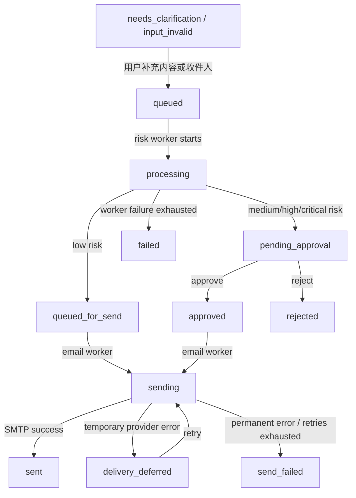

# 企业知识问答与邮件协作 Agent 简历逐句实现说明

本文用于解释简历中这段项目描述的每个关键点如何在代码中落地，重点服务面试复述与追问准备。

> 企业知识问答与邮件协作 Agent: 该 Agent 能力为，基于企业文档的问答、读取新邮件、生成每日邮件早报、总结或起草外发稿，并在真实发送前执行 DLP（数据防泄露）检测、必要人工审批和邮件发送。技术实现为基于 LangGraph 搭建 Agent 工作流，设计可挂起/恢复的 DLP 审批状态机。实现 IMAP 邮件读取、PII 隐私检测、人工审批与 SMTP 真实发送全链路闭环。引入规则与大模型（GLM-4.5-Air）的混合意图分类路由，结合 Fast/Slow Path 双路执行机制，提升复杂多意图的分发精度与响应效率。RAG 架构：重构检索流水线，采用 BAAI/bge-m3 (基于 Chroma) 与 SQLite FTS5 (基于 BM25) 构建稠密+稀疏双路召回。接入 bge-reranker-v2-m3 交叉编码器进行深度语义重排。Hermes-style Memory：参考 Hermes 构造记忆系统。动态聚合工作区混合检索内容、短期会话记录、多轮总结与用户画像偏好。制定了对话记忆、任务记忆与企业知识的隔离策略，确保敏感企业数据防越权与防污染。MCP 工具链与全链路观测：利用 MCP 解耦系统能力，通过标准输入输出与 JSON-Lines 实现隐私扫描、实体消歧、上下文预算等模块的跨 Agent 安全复用。接入 Prometheus 以实时监控路由命中率、Token 成本消耗、检索召回率及工作流流转状态等关键指标。

阅读这份文档时，可以把代码字段按三类理解：

| 类型 | 怎么读 |
|---|---|
| `xxx_id` | 追踪对象的唯一标识，比如任务 ID、草稿 ID、文档 ID。 |
| `xxx_type` / `intent` | 分类结果，表示系统认为用户当前要做哪类事情。 |
| `resolved_xxx` | 已经解析完成、可以执行或展示的结果，比如解析出的收件人、主题、正文。 |
| `requires_xxx` | 安全门禁字段，表示是否必须满足某个条件才能继续。 |
| `source_xxx` / `refs` / `provenance` | 来源追踪字段，用来说明内容来自哪里，便于审计和防污染。 |

## 1. 总体架构口径

这个项目当前最准确的架构口径是：

```text
Streamlit UI
-> FastAPI /agent/chat
-> Fast/Slow Router
-> ReAct Controller / legacy planner fallback
-> Tool Registry / Dispatch
-> EnterpriseRAG / Mail / DLP / Memory / MCP tools
-> PostgreSQL / SQLite / Chroma / Redis-Celery / IMAP / SMTP
```

### 1.1 项目框架构造与层级关系

从工程层级看，项目不是一个“大 prompt + 若干函数”的结构，而是分成多层：

| 层级 | 作用 | 代表模块 |
|---|---|---|
| UI 层 | 承接用户输入、展示聊天、任务台和调试信息 | `web/streamlit_app.py` |
| API 层 | 暴露 `/agent/chat`、RAG、邮件、任务、metrics 等接口 | `app/main.py` |
| 路由层 | 判断请求走 Fast Path 还是 Slow Path，决定 intent 和推荐工具 | `app/orchestration/fast_router.py`, `app/hybrid_router.py` |
| 编排层 | 决定当前步骤要读 memory、调工具、追问、确认还是直接回答 | `app/orchestration/service.py`, `app/orchestration/react_controller.py` |
| 计划/执行层 | 对复杂请求可生成 task plan，并按依赖执行子任务 | `app/orchestration/planner.py`, `app/orchestration/executor.py` |
| 工具注册与 dispatch 层 | 根据 tool name 查 registry，做参数和副作用检查，再分发给 handler | `app/orchestration/tool_discovery.py` |
| handler 层 | 每个工具的统一入口，负责把结构化参数交给业务模块 | `app/orchestration/tools/*.py` |
| 业务能力层 | 真正执行 RAG、邮件、DLP、Memory、MCP、发送等能力 | `app/enterprise_rag/*`, `app/inbound_mail.py`, `app/privacy_lab.py`, `app/task_worker.py` |
| 基础设施层 | 持久化、检索、队列、外部邮箱与监控 | PostgreSQL, SQLite, Chroma, Redis/Celery, IMAP, SMTP, Prometheus |

数据流向可以简化成：

```text
用户输入
-> API request
-> Fast/Slow routing
-> orchestration decision
-> dispatch tool call
-> handler
-> business module
-> database / vector store / external service
-> observation
-> final answer or task state update
```

这里 `dispatch` 和 `handler` 的关系很重要：`dispatch` 是总分发和安全门禁，只负责查工具、校验参数、阻断未授权副作用；`handler` 是具体工具入口，例如 `enterprise_rag_query`、`privacy_scan`、`send_email_smtp`。业务逻辑再由 handler 调用更底层模块完成。

需要特别说明：项目中确实使用了 LangGraph，例如 `app/sensitive_workflow.py`、`app/unified_agent.py`、`app/graph.py` 中都有 `StateGraph` 工作流；但当前企业邮件协作主链已经演进成 `FastAPI /agent/chat + Fast/Slow Router + 自研 ReAct Controller + Tool Registry + Celery 状态机`。面试时如果被追问，建议说：

> 早期和专项 workflow 使用 LangGraph StateGraph 表达节点流转；当前主线为了更细粒度控制工具、审批和状态恢复，使用自研 orchestration 与异步任务状态机承接核心链路。

相关代码：

- `app/main.py`：FastAPI 入口，包含 `/agent/chat`、企业 RAG、邮件、任务审批、metrics 等接口。
- `app/orchestration/service.py`：主编排入口，默认调用 ReAct controller，必要时走 legacy planner fallback。
- `app/orchestration/react_controller.py`：当前主 Agent controller。
- `app/orchestration/tool_discovery.py`：工具注册、发现、dispatch 与副作用门禁。
- `app/task_store.py`：DLP 任务状态、事件、审批记录。
- `app/task_worker.py`：DLP 风险评估与邮件发送 worker。

## 2. “基于企业文档的问答”如何实现

企业文档问答由 EnterpriseRAG 实现，主入口是 `answer_enterprise_question(...)`。

流程如下：

```text
用户问题
-> build_retrieval_plan
-> dense recall: Chroma + BAAI/bge-m3
-> sparse recall: SQLite FTS5 + BM25
-> merge by chunk_id
-> heuristic candidate score + diversification
-> bge-reranker-v2-m3 cross-encoder rerank
-> sentence-level evidence
-> canonical facts
-> answer intent / slots
-> constrained answer + citations
```

核心实现：

- `app/enterprise_rag/core/service.py`：串起 retrieval plan、检索、memory context、答案生成。
- `app/enterprise_rag/core/query_planner.py`：根据问题类型分配 `small / medium / large / expanded` 检索预算。
- `app/enterprise_rag/core/retrieval_orchestrator.py`：dense、sparse、merge、rerank、evidence selection。
- `app/enterprise_rag/core/answer_composer.py`：answer intent、canonical facts、answer slots、最终答案。
- `app/vectorstore.py`：Chroma 连接、embedding、upsert、collection 管理。
- `app/enterprise_rag/libs/sparse_index.py`：SQLite FTS5 sparse index。

索引侧存储两套数据：

| 存储 | 用途 | 主要字段 |
|---|---|---|
| Chroma | 稠密向量检索 | `chunk_id`, `doc_id`, `source_type`, `title`, `chunk_index`, `chunk_strategy`, `thread_id`, `timestamp`, `collection_version` |
| SQLite FTS5 | 稀疏全文检索 | `chunk_id`, `doc_id`, `source_type`, `title`, `content`, `business_domain`, `thread_id`, `timestamp` |

更具体地说，Chroma 侧以 `chunk_id` 作为向量 id，`document` 存 chunk 文本，`metadata` 存 `doc_id/source_type/title/thread_id/timestamp/collection_version/chunk_strategy` 等字段。SQLite 侧有普通表 `enterprise_chunks` 保存完整 chunk 元数据，另有 FTS5 虚拟表 `enterprise_chunks_fts` 对 `source_type/title/content/business_domain` 建全文索引。

### 2.1 RAG 如何 query 与匹配

一次企业问答查询的执行过程是：

1. `build_retrieval_plan(...)` 先判断问题类型，例如 `basic / semantic / constrained / conflicting`，再分配检索预算。
2. dense recall 调 Chroma `similarity_search(query, k=dense_top_k, filter=...)`，filter 至少包含 `domain=enterprise`，必要时加 `source_type`。
3. sparse recall 调 SQLite FTS5，用 query token 生成 `MATCH` 表达式，再按 `bm25(...)` 排序。
4. dense 和 sparse 结果按 `chunk_id` 合并，来源标记为 `dense / sparse / hybrid`。
5. 合并后先计算 `heuristic_candidate_score`，它会综合 lexical overlap、title match、phrase match、answer fact hint、answerability boost、source boost、retrieval boost 和 noise penalty。
6. reranker 再用 `bge-reranker-v2-m3` 对 `[query, passage]` 做 cross-encoder 精排。
7. 最终排序分数是 `cross_encoder_score + heuristic_score * 0.8`。
8. evidence selection 会限制单文档 chunk 数，避免同一文档刷屏。

所以“检索出来之后用什么匹配”可以回答为：

> 先用 embedding 相似度和 BM25 做双路召回，再用启发式分数做候选粗排，最后用 cross-encoder reranker 做 query-passage 深度匹配。

### 2.2 RAG 模型参数

编码模型：

- `ENTERPRISE_EMBEDDING_MODEL=BAAI/bge-m3`
- 本地路径：`ENTERPRISE_EMBEDDING_LOCAL_DIR=/app/external-models/bge-m3`
- 初始化：`HuggingFaceEmbeddings`
- device：`EMBEDDING_DEVICE`，当前默认 `cpu`
- encode 参数：`normalize_embeddings=True`

重排模型：

- `ENTERPRISE_RERANKER_MODEL=BAAI/bge-reranker-v2-m3`
- 本地路径：`ENTERPRISE_RERANKER_LOCAL_DIR=/app/external-models/bge-reranker-v2-m3`
- 初始化：`sentence_transformers.CrossEncoder`
- device：同样走 `EMBEDDING_DEVICE`
- 参数：`trust_remote_code=True`

面试可讲：

> 企业问答不是把全文直接塞给模型，而是先把企业文档切成带元数据的 chunk，分别写入 Chroma 和 SQLite FTS5。查询时先按问题类型给检索预算，再做 dense+sparse 双路召回，合并后由 reranker 深度重排，最后抽证据句和 canonical facts，生成带 citation 的受约束答案。

## 3. “读取新邮件”如何实现

读取新邮件通过 IMAP 只读同步实现，不直接修改用户邮箱。

实现链路：

```text
IMAP_ENABLED=true
-> imaplib.IMAP4_SSL
-> 搜索时间窗内邮件 UID
-> 解析 MIME
-> 提取 text/plain 或 text/html 可见文本
-> 生成 message_id / sender / recipients / subject / received_at / snippet / summary / risk_hint
-> 写入 inbound_mail_messages
```

核心实现：

- `app/inbound_mail.py`：IMAP 连接、邮件拉取、MIME/HTML 解析、摘要生成。
- `app/inbound_mail_store.py`：PostgreSQL 收件箱存储。
- `app/task_worker.py`：`sync_inbound_mail_task` 异步任务。
- `app/task_queue.py`：`MAIL_QUEUE` 邮件同步队列。
- `app/main.py`：`/mail/inbound/sync`、`/mail/inbound/sync/async`、`/mail/inbound/messages`。

数据库层面：

- `inbound_mail_messages` 存同步后的邮件。
- `mail_sync_state` 记录同步游标和错误。
- `notification_outbox` 存新邮件通知和早报事件。

面试可讲：

> 收件能力不是模拟数据，而是通过 IMAP SSL 只读同步邮箱。同步后邮件会被 MIME 解析和 HTML 清洗，再结构化落入 PostgreSQL，后续早报、搜索、回复草稿都基于这份本地标准化数据。

## 4. “生成每日邮件早报”如何实现

每日邮件早报建立在已同步邮件之上，不是每次临时全量扫描邮箱。

实现链路：

```text
generate_daily_mail_digest
-> 从 inbound_mail_messages 按时间窗读取
-> 统计 total / unread / important
-> 选取重要邮件
-> 生成 digest
-> 写入 notification_outbox
```

核心实现：

- `app/inbound_mail.py`：`generate_daily_mail_digest(...)`。
- `app/task_worker.py`：`generate_daily_mail_digest_task`。
- `app/task_queue.py`：`enqueue_daily_mail_digest()`。
- `app/main.py`：`/mail/inbound/digest`、`/mail/inbound/digest/async`、`/mail/inbound/summary`。

面试可讲：

> 每日早报不是让模型直接读邮箱，而是先同步邮件入库，再按时间窗聚合统计和筛选重要消息。这样早报结果稳定，也可以自然接入定时任务和通知 outbox。

## 5. “总结或起草外发稿”如何实现

外发稿不是直接让 LLM 自由写，也不是用户一说“发出去”系统就真的发信。项目先把用户的自然语言请求转换成结构化邮件动作计划，也就是 `mail_plan`。它的作用可以理解为：把“帮我把这个总结一下发给老板”这类模糊请求，拆成系统可执行、可审计、可审批的一组字段。

处理入口在 `/agent/chat`：

```text
用户提出发信 / 回复 / 转发 / 润色 / 改写
-> looks_like_mail_action_request
-> build_mail_action_plan
-> 识别 action_type
-> 收集候选内容
-> 生成 mail_plan
-> draft_only / confirmation_required / needs_clarification
-> 用户确认后创建 DLP task
```

这条链路里的几个名字可以这样理解：

| 代码名 | 面试解释 |
|---|---|
| `looks_like_mail_action_request` | 一个“入口判断器”，用来判断用户当前这句话是不是邮件相关动作。比如“帮我起草发给客户的回复”“把上面的内容发给 Alice”“润色一下这封邮件”会进入邮件链路；普通企业知识问答不会进入。 |
| `build_mail_action_plan` | 邮件计划构造器。它不负责真正发信，而是从用户请求、上传文件、最近对话、上一轮回答里提取收件人、主题、正文来源、附件、是否需要总结等信息。 |
| `action_type` / `mail_action_type` | 邮件动作类型，也就是用户到底想做什么。系统会先识别是发新邮件、回复、转发、润色、改写、查状态，还是带附件发送。 |
| `candidates` | 候选内容池。比如用户刚上传的文件、用户刚输入的大段文字、上一轮助手生成的总结、历史草稿，都可能成为邮件正文或附件来源。 |
| `selected_candidate` | 系统最终选中的正文来源。比如用户说“把刚才的总结发给他”，那选中的通常是上一轮助手答案。 |
| `attachment_candidate` | 系统最终选中的附件来源。比如用户上传了 PDF 并说“连同附件一起发”，这里会记录要带上的文件。 |
| `referential_request` | 指代型请求标记。比如“把这个发给张三”“就发刚才那段”，这里的“这个”“刚才那段”需要回到对话上下文里解析。 |
| `explicit_summary` | 明确总结请求标记。比如“总结一下再发”“压缩成邮件正文”，系统会知道不能原文照搬，而要生成摘要式正文。 |
| `send_both` | 同时发送正文与附件。比如“邮件里简单说明，并附上原文件”，系统会生成正文，也会保留附件。 |

支持的动作类型不是给用户看的固定菜单，而是系统内部为了安全执行而定义的分类：

| 动作类型 | 含义 |
|---|---|
| `send_message` | 发一封新邮件。系统需要解析收件人、主题、正文来源，并在发送前创建 DLP 审批任务。 |
| `send_with_attachment` | 发新邮件并带附件。除了正文外，还要把上传文件或已识别文件作为附件候选。 |
| `reply_message` | 回复已有邮件。系统必须先知道要回复哪一封邮件，否则会要求用户澄清。 |
| `forward_message` | 转发已有邮件。系统必须先找到原邮件和新的收件人，否则不会盲目执行。 |
| `polish_body` | 只润色正文，不进入真实发送流程，通常返回 `draft_only`。 |
| `rewrite_body` | 按用户要求改写正文，比如“更正式”“更简短”，同样通常只生成草稿。 |
| `query_delivery_status` | 查询已有任务或邮件的投递状态，属于只读能力。 |
| `recall_message` | 撤回邮件。当前返回 `unsupported`，因为 SMTP/IMAP 不保证邮件可撤回，系统不会假装这个高风险能力一定可用。 |

核心实现：

- `app/outbound_delivery.py`：解析邮件动作、内容来源、收件人、正文约束、附件策略。
- `app/main.py`：`_build_mail_action_plan(...)`、`_create_dlp_task_from_mail_plan(...)`。
- `app/task_store.py`：任务创建和状态持久化。

`mail_plan` 是这条链路最关键的中间结果。它不是一段自然语言，而是一个结构化对象：

| 字段 | 含义 |
|---|---|
| `draft_id` | 草稿 ID，用来追踪这次起草或发送请求。 |
| `conversation_id` | 当前对话 ID，用来把邮件计划和当前会话关联起来。 |
| `status` | 当前计划状态。常见是 `draft` 或 `pending_confirmation`。 |
| `mail_action_type` | 识别出的动作类型，比如 `send_message`、`polish_body`。 |
| `target_object` | 用户想操作的对象，比如“上一轮总结”“上传文件”“某封邮件”。 |
| `resolved_recipients` | 已解析出的收件人列表。这里会从自然语言里抽取邮箱地址或联系人。 |
| `resolved_subject` | 系统生成或解析出的邮件主题。 |
| `resolved_body` | 最终准备用于 DLP 检测和用户确认的邮件正文草稿。 |
| `resolved_attachments` | 需要随邮件发送的附件列表。 |
| `source_refs` | 正文或附件来自哪里，比如上传文件、上一轮回答、用户输入文本。 |
| `requires_confirmation` | 是否必须经过用户确认。真实外发通常必须为 `true`。 |
| `missing_fields` | 缺失字段列表。比如没有收件人、没有正文、找不到要回复的邮件。 |
| `review_content` | 送去 DLP 检测的内容。通常包含邮件正文和必要元信息。 |
| `body_constraints` | 用户对正文的约束，比如“简短一点”“正式语气”“不要太长”“总结成三点”。 |
| `body_sources` | 正文生成时允许使用的来源，防止模型把无关上下文混进邮件。 |
| `source_policy` | 来源使用策略，比如只用附件、只用用户显式提供内容、只发送摘要。 |
| `unsupported_reason` | 如果动作不支持，这里记录原因，方便返回明确解释而不是静默失败。 |

构造完 `mail_plan` 后，系统会根据结果进入不同分支：

| 返回状态 | 什么时候出现 | 系统行为 |
|---|---|---|
| `draft_only` | 用户只是要求润色、改写、总结，不要求真实发送。 | 直接返回草稿，不创建发送任务。 |
| `confirmation_required` | 系统已经拿到收件人、正文、附件等关键信息，并且用户有发送意图。 | 先让用户确认，再创建 DLP 审批任务。 |
| `needs_clarification` | 缺少关键字段，比如不知道发给谁、不知道“这个”指什么。 | 追问用户，不猜测执行。 |
| `unsupported` | 动作风险过高或当前不支持，比如撤回邮件。 | 返回受限说明，不执行副作用操作。 |

和 DLP 状态机的关系是：`mail_plan` 只是“准备发送的结构化草稿”，真正进入外发闭环前，还要由 `_create_dlp_task_from_mail_plan(...)` 把它转换成 DLP task。也就是说，外发链路不是 `起草 -> 发送`，而是：

```text
起草 mail_plan
-> 用户确认
-> 创建 DLP task
-> PII / 敏感信息扫描
-> 低风险自动通过或高风险进入人工审批
-> 审批通过后才允许 SMTP 真实发送
```

面试可讲：

> 起草外发稿时，我没有让 Agent 直接生成一段文本然后发送，而是先构造结构化 mail plan。mail plan 会记录动作类型、收件人、主题、正文、附件、内容来源、缺失字段和是否需要确认。润色和改写只返回草稿；真实发送必须经过用户确认、DLP 扫描和必要审批。这保证了生成能力和副作用执行之间有清晰安全边界。

## 6. “DLP 检测”如何实现

DLP 检测由规则、动态 policy 和可选模型风险总结组成。

同步扫描能力：

- `app/privacy_lab.py`：`scan_sensitive_message(...)` 识别 PII、密钥、邮箱、手机号、敏感关键词等。
- SQLite `privacy_policies` 支持 active policy 热更新。
- 读取失败时回退静态规则。

异步任务中的 DLP：

```text
process_dlp_outbound_task
-> scan_sensitive_message
-> retrieve_dlp_evidence
-> model_summary_and_risk
-> rule risk + model risk 合并
-> approval_required = risk in medium/high/critical
```

这里的字段可以这样讲：

| 字段 / 步骤 | 含义 |
|---|---|
| `scan_sensitive_message` | 本地敏感信息扫描入口，负责识别手机号、邮箱、密钥、身份证样式、敏感关键词等确定性风险。 |
| `retrieve_dlp_evidence` | 从 DLP policy 或规则证据库里取相关治理依据，帮助模型解释为什么这段内容有风险。 |
| `model_summary_and_risk` | 可选的模型风险总结，用来把规则命中转成更可读的风险说明。 |
| `risk_level` | 风险等级，通常是 `low / medium / high / critical`。它决定是否需要人工审批。 |
| `risk_reasons` | 风险原因列表，例如“包含个人手机号”“包含客户邮箱”“命中财务敏感关键词”。 |
| `redactions` | 脱敏位置或脱敏项，用来说明哪些内容应该被隐藏或替换。 |
| `redacted_text` | 脱敏后的文本，适合在任务台或审批台展示。 |
| `approval_required` | 是否需要人工审批。中高风险一般会设为 `true`。 |
| `policy_version` | 当前使用的动态 policy 版本，用来证明规则是热更新的，不是服务启动时写死的。 |
| `policy_source` | 本次扫描使用的是动态 policy 还是静态 fallback。 |

核心实现：

- `app/privacy_lab.py`：PII 扫描和 policy 热更新。
- `app/dlp_runtime.py`：DLP policy evidence retrieval 与模型总结风险。
- `app/task_worker.py`：`_run_rule_retrieval_model_pipeline(...)`、`process_dlp_outbound_task(...)`。

面试可讲：

> DLP 不是一个简单正则。系统先做本地 PII 和密钥规则扫描，再结合动态 policy 与 DLP evidence，必要时调用模型生成风险摘要。最终输出 risk_level、risk_reasons、redactions 和 redacted_text，作为审批状态机的输入。

## 7. “必要人工审批和邮件发送”如何实现

这是项目里最核心的治理闭环：真实发送不在聊天线程里直接发生，而是进入可挂起/恢复的任务状态机。

### 7.1 任务状态机的核心表

核心表在 PostgreSQL：

| 表 | 作用 |
|---|---|
| `dlp_tasks` | 主任务表，保存当前状态、风险、收件人、正文、发送结果 |
| `dlp_task_events` | 事件日志，记录状态变化和 worker 行为 |
| `dlp_task_approvals` | 审批记录，保存 approve/reject、actor、reason |

`dlp_tasks` 可以理解成“外发任务的当前快照”。常见字段含义如下：

| 字段 | 含义 |
|---|---|
| `task_id` | 外发任务 ID，是审批、查询、WebSocket 推送和 worker 恢复执行的主键。 |
| `session_id` / `conversation_id` | 把任务和用户当前会话关联起来，方便用户继续补充或查询。 |
| `recipient` / `recipients` | 目标收件人。系统不会把没有收件人的任务直接发送。 |
| `subject` | 邮件主题。可以来自用户显式输入，也可以由草稿生成。 |
| `content` / `body` | 待检测、待审批、待发送的邮件正文。 |
| `risk_level` | DLP 评估出的风险等级。 |
| `risk_reasons` | 触发风险的原因，供用户和审批人理解。 |
| `status` | DLP / 审批主状态，比如 `queued`、`processing`、`pending_approval`、`sent`。 |
| `delivery_status` | SMTP 发送子状态，比如 `not_sent`、`sending`、`sent`、`send_failed`。 |
| `last_error` / `last_error_category` | 最近一次失败的错误信息和错误类别，便于恢复或排障。 |

核心实现：

- `app/task_store.py`：建表、创建任务、更新状态、审批、事件。
- `app/task_worker.py`：异步风险处理和发送。
- `app/task_queue.py`：Celery 队列。
- `app/main.py`：`/tasks/{task_id}/approve`、`/tasks/{task_id}/reject`、`/ws/tasks/{task_id}`。

### 7.2 主状态与发送状态

系统有两层状态：

| 字段 | 含义 |
|---|---|
| `status` | 任务主状态，例如 `queued`、`processing`、`pending_approval`、`approved`、`sent` |
| `delivery_status` | 邮件发送子状态，例如 `not_sent`、`queued_for_send`、`sending`、`sent`、`send_failed` |

这样做的好处是：

- DLP 审批状态和 SMTP 发送状态不会混在一起。
- 一个任务可以先处于 `approved`，但邮件还没有真正发出。
- 发送失败可以保留治理通过的事实，同时记录 `send_failed` 和错误原因。

### 7.3 状态流转

主要状态流转如下：



### 7.4 不同任务与状态机的关系

| 任务类型 | 是否进入 DLP 状态机 | 说明 |
|---|---:|---|
| 企业知识问答 | 否 | 只读 RAG 查询，不产生副作用。 |
| 读取新邮件 | 否 | 只读 IMAP 同步，进入 `MAIL_QUEUE`，不走 DLP 发信状态机。 |
| 每日邮件早报 | 否 | 基于本地收件库聚合，进入 `MAIL_QUEUE`。 |
| 润色/改写正文 | 通常否 | `draft_only`，只生成草稿，不发送。 |
| 准备外发但缺内容/收件人 | 是，但挂起 | 创建 `needs_clarification` 或 `input_invalid` 任务，等待补充。 |
| 用户确认发送 | 是 | 创建 `queued` 任务，进入 DLP 风险 worker。 |
| 中高风险外发 | 是，挂起 | 状态进入 `pending_approval`，等待人工 approve/reject。 |
| 低风险外发 | 是，自动推进 | `processing -> queued_for_send -> sending -> sent`。 |
| SMTP 临时失败 | 是，可恢复 | 进入 `delivery_deferred`，worker 自动重试。 |
| SMTP 永久失败 | 是，终止或人工接管 | 进入 `send_failed`，记录错误与建议动作。 |
| DLP scenario replay | 是 | 使用同一 `dlp_tasks` 状态机，加 fault injection 和 expected outcome。 |

### 7.5 挂起与恢复如何实现

挂起不是内存里的暂停，而是数据库状态持久化：

- 缺少信息时，任务以 `needs_clarification` 或 `input_invalid` 持久化。
- DLP 风险较高时，任务以 `pending_approval` 持久化。
- 发送临时失败时，任务以 `delivery_deferred` 持久化。
- 用户补充、审批、重试时，API 根据 `task_id/session_id/conversation_id` 找回任务并继续推进。

恢复入口：

- 用户补充缺失内容：`get_latest_recoverable_task(...)` 找到可恢复任务并补充。
- 人工审批：`approve_task(...)` 把 `pending_approval` 改成 `approved`。
- 邮件发送：审批后 `enqueue_email_send_task(...)` 进入 email queue。

面试可讲：

> 这里的状态机不是 Python 内存里的流程，而是 PostgreSQL 中的持久化状态机。任务可以停在 `needs_clarification`、`pending_approval` 或 `delivery_deferred`，之后通过用户补充、人工审批或 worker retry 恢复执行。状态变化都会写入事件表，审批动作也单独写审批表。

### 7.6 事件或工具失败时如何处理

项目把失败分成同步工具失败、RAG 检索失败、DLP/Policy 降级、异步任务失败几类处理。

同步工具失败：

- 所有工具调用统一经过 `dispatch_tool_call(...)`。
- 未知工具返回 `unknown action`。
- 参数不是 dict 返回结构化错误。
- 未授权副作用工具返回 `confirmation_required`。
- handler 抛异常会被捕获，返回 `ok=false/error=...`，不会让主链直接崩。

ReAct controller 防失控：

- `REACT_MAX_STEPS` 限制总步数。
- `REACT_MAX_TOOL_FAILURES` 限制工具失败次数。
- `REACT_MAX_SAME_TOOL_RETRIES` 限制同一工具重复重试。

RAG 失败降级：

- dense recall 失败返回空列表。
- sparse recall 失败返回空列表。
- reranker 失败时退回 heuristic fallback。
- 没有可靠证据时返回证据不足，而不是让模型编答案。

DLP 和 policy 失败降级：

- 动态 policy 读取失败时回退静态规则。
- policy evidence retrieval 失败时进入 `rule_only` 模式。
- 模型总结失败或超时时，仍保留规则扫描结果作为保守判断。

异步任务失败：

- Celery worker 支持 retry backoff。
- 风险评估失败最终进入 `failed`。
- SMTP 临时错误进入 `delivery_deferred`，可自动重试。
- SMTP 永久错误或重试耗尽进入 `send_failed`。
- 每次状态变化都会写 `dlp_task_events`，并通过 WebSocket 推送到任务台。

面试可讲：

> 失败不会只表现成 500。同步工具失败会转成结构化 observation；RAG 失败会局部降级；DLP 策略失败会回退静态规则；异步发送失败会进入明确状态，比如 `delivery_deferred` 或 `send_failed`，并写事件日志和 Prometheus 指标。

## 8. “IMAP + PII + 审批 + SMTP 全链路闭环”

完整闭环可以这样解释：

```text
IMAP 读取新邮件
-> 用户要求总结/回复/转发
-> mail_plan 生成草稿或外发计划
-> 用户确认发送
-> 创建 dlp_tasks
-> DLP risk worker
-> 低风险直接 queued_for_send
-> 中高风险 pending_approval
-> 人工 approve/reject
-> email worker
-> MCP send_email_smtp
-> SMTP 真实发送
-> 写回 sent/send_failed/delivery_deferred
-> 前端任务台/WebSocket/Prometheus 可观测
```

这个闭环的关键是：读邮件和写邮件是分开的。IMAP 只读；SMTP 发送必须经过 DLP、审批和 worker。

## 9. “规则与大模型 GLM-4.5-Air 混合意图分类路由”如何实现

项目里有两层路由思想。

第一层是企业邮件协作主链的 Fast Router：

- `app/orchestration/fast_router.py`
- 默认用 `GLM-4.5-Air` 做轻量 L0 routing。
- 如果 LLM router 失败，回退到规则 router。
- 输出 `route_mode`、`intent`、`required_grounding`、`recommended_tool`、`confidence`。

这些路由字段的含义是：

| 字段 | 含义 |
|---|---|
| `route_mode` | 当前请求走快路径还是慢路径。快路径通常是单工具、低风险；慢路径通常需要多步推理或工具链。 |
| `intent` | 用户意图分类，例如企业问答、邮件草稿、DLP 检测、任务状态查询。 |
| `required_grounding` | 回答是否必须基于外部证据，例如企业文档、邮件库或任务库。 |
| `recommended_tool` | 路由器建议调用的工具名，例如 `enterprise_rag_query`、`privacy_scan`。 |
| `confidence` | 路由置信度。低置信或冲突场景会进入更保守的慢路径或 fallback。 |

第二层是早期/实验型 hybrid router：

- `app/hybrid_router.py`
- 先做规则命中。
- 高置信规则直接返回。
- 规则冲突或不确定时调用 LLM router。
- 典型 intent 包括 `privacy_alert`、`long_document_budget`、`entity_disambiguation` 等。

主模型配置：

- `LLM_MODEL_MAIN=glm-4.5-air`
- `LLM_MODEL_ROUTER=glm-4.5-air`

面试可讲：

> 路由不是完全靠大模型。高置信、可规则化的场景先用规则快速处理；模糊或多意图场景再调用 GLM-4.5-Air 做 JSON 分类。这样既减少成本和延迟，也避免规则覆盖不了复杂表达。

## 10. “Fast/Slow Path 双路执行机制”如何实现

Fast Path 用于低成本、确定性高的请求：

- 上传文档总结/问答。
- 对话记忆查询。
- 邮箱状态查询。
- 企业事实问答直接调用 `enterprise_rag_query`。
- 简单 self-introduction / chitchat。

Slow Path 用于复杂、多步、混合意图请求：

- 进入 `orchestrate_agent_request(...)`。
- 默认走 `run_react_agent_request(...)`。
- ReAct controller 可多步读取 memory、调用工具、生成最终回答。
- ReAct 失败时可按配置进入 legacy planner fallback。

面试可讲：

> Fast Path 负责明确、单工具、低风险请求；Slow Path 负责混合意图、多步骤或需要规划的请求。这样不会把所有请求都拖进重型 ReAct loop，也不会牺牲复杂任务的处理能力。

## 11. RAG 架构如何实现

RAG 的核心是稠密+稀疏+重排。

### 11.1 稠密召回

- 模型：`BAAI/bge-m3`
- 存储：Chroma `enterprise_rag_bench_v2`
- 初始化：`HuggingFaceEmbeddings`
- 参数：`normalize_embeddings=True`
- 本地模型路径：`/app/external-models/bge-m3`

### 11.2 稀疏召回

- 存储：SQLite `enterprise_sparse.db`
- 索引：FTS5
- 排序：`bm25(enterprise_chunks_fts, ...)`
- 查询：将 query token 转为 FTS `MATCH` 表达式。

### 11.3 交叉编码器重排

- 模型：`BAAI/bge-reranker-v2-m3`
- 实现：`sentence_transformers.CrossEncoder`
- 输入：`[query, passage]`
- passage 包含 `title/source/content`
- 最终分：`cross_encoder_score + heuristic_score * 0.8`

### 11.4 检索预算

`build_retrieval_plan(...)` 会按问题类型分配预算：

| budget | dense_top_k | sparse_top_k | rerank_top_k | evidence_top_k |
|---|---:|---:|---:|---:|
| small | 24 | 12 | 6 | 4 |
| medium | 40 | 24 | 10 | 5 |
| large | 60 | 40 | 16 | 8 |
| expanded | 80 | 60 | 20 | 10 |

`expanded` 不是默认首轮预算，而是第一轮证据不足时二阶段扩容。

### 11.5 Chroma 当前存入的数据来源

当前 Chroma 里主要有三类 collection：

| collection | 作用 | 典型来源 |
|---|---|---|
| `enterprise_rag_bench_v2` | 当前 EnterpriseRAG 主知识库 | `fireflies`, `github`, `gmail`, `google_drive`, `linear` |
| `workspace_memory_v1` | 工作区记忆 | `bootstrap/agent_identity.md`, `notes/README.md`, `skills/README.md` |
| `leetcode_rag_v1` | 历史 legacy 混合集合 | LeetCode 语料、早期 turn summary、旧企业源 chunk |

面试时建议强调：当前企业问答权威数据源是 `enterprise_rag_bench_v2`，workspace context 走 `workspace_memory_v1`，`leetcode_rag_v1` 属于历史演进留下的混合 collection，不应作为当前企业知识的主依据。

### 11.6 三类检索策略优化

项目针对“全量 hybrid 检索会慢”做了三类策略优化：

| 策略 | 解决的问题 | 实现思路 |
|---|---|---|
| Workspace Retrieval Policy Engine | workspace 问题不一定需要 full hybrid | 先判断 query 是 exact path、FTS first 还是 hybrid，再决定是否启用 vector |
| EnterpriseRAG Adaptive Retrieval Budget | 企业问答不应每次跑最大召回和 rerank | 根据问题类型分配 small/medium/large 预算，证据不足时才 expanded second pass |
| Follow-up Memory Retrieval Plan | 追问类 memory 检索不应无脑扩大 top_k | 先判断是否 follow-up、是否有 entity anchors，再决定 recent turn、summary 或扩展读取 |

这三类策略的共同目标是：

> 不取消 hybrid，而是把贵的 retrieval 留给真正需要它的请求。

## 12. Hermes-style Memory 如何实现

Memory 不是单一向量库，而是多层 memory substrate。

### 12.1 结构化 SQLite memory

`app/hermes_dynamic_memory.py` 中维护：

- `hermes_turn_summaries`
- `hermes_user_memory_facts`
- `hermes_reflection_candidates`
- `hermes_transcript_compactions`

结构化字段包括：

| 字段 | 含义 |
|---|---|
| `summary` | 对当前 turn 或一小段对话的压缩摘要，供后续检索和展示。 |
| `intent` | 这一轮用户主要意图，例如企业问答、邮件起草、审批查询、偏好记忆。 |
| `entities` | 抽取出的关键实体，比如人名、公司、文件名、项目名、任务 ID。 |
| `files_uploaded` | 本轮涉及的上传文件列表，避免后续误把文件上下文丢掉。 |
| `risk_level` | 记忆本身的风险等级。涉及敏感策略或高风险偏好时不会直接生效。 |
| `memory_scope` | 记忆作用域，例如当前会话、用户偏好、工作区上下文。 |
| `provenance` | 记忆来源，说明是从哪轮对话、哪个任务或哪个文件抽取出来的。 |

### 12.2 对话与摘要记忆

- recent turns 从 conversation store 直接读取。
- turn summary / merged summary 可写入 Chroma 做语义召回。
- compaction 用于长对话压缩。

### 12.3 Workspace memory

- 工作区 Markdown 记忆支持 retrieval policy。
- 明确路径查询走 exact path。
- 关键词/配置查询走 FTS。
- 语义问题才走 hybrid。

面试可讲：

> Hermes-style Memory 的重点不是简单存聊天记录，而是把短期 turns、结构化 turn summary、用户偏好候选、workspace memory 和 compaction 分层管理。读取时先判断 memory kind，再选择 recent read、summary vector retrieval 或 workspace hybrid retrieval。

## 13. “对话记忆、任务记忆与企业知识隔离”如何实现

隔离策略分三类：

| 类型 | 存储 | 作用 | 是否可作为企业事实证据 |
|---|---|---|---|
| 对话记忆 | SQLite conversation store + Hermes memory + Chroma summary | 当前会话上下文、偏好、摘要 | 否 |
| 任务记忆 | PostgreSQL `dlp_tasks/events/approvals` | DLP 任务状态、审批、发送结果 | 否 |
| 企业知识 | Chroma enterprise collection + SQLite FTS5 | 企业文档事实问答 | 是 |

关键规则：

- 企业事实必须走 `enterprise_rag_query`。
- memory 只能提供上下文，不能替代 enterprise evidence。
- 任务状态只能回答“任务进度/审批/发送状态”，不能混入企业知识回答。

面试可讲：

> 我们做的是 data source role separation。对话记忆提供上下文，任务记忆提供治理状态，企业知识提供可引用证据。这样可以防止聊天摘要污染企业事实，也防止 DLP 任务状态被误当成知识库证据。

## 14. MCP 工具链如何实现

项目实现的是 MCP-style 本地工具协议。

### 14.1 工具注册

工具通过 `@register_tool(...)` 注册 manifest：

| 字段 | 含义 |
|---|---|
| `name` | 工具名，也是 Planner、ReAct controller 或 MCP client 调用时使用的 action 名。 |
| `description` | 工具能力说明，帮助路由器或外部 Agent 理解什么时候该调用它。 |
| `input_schema` | 输入参数结构，约束调用方必须传哪些字段。 |
| `read_only` | 是否只读。只读工具不会改变外部世界，例如查询、扫描、预算估算。 |
| `side_effectful` | 是否有副作用。比如真实发邮件、修改任务状态都属于副作用。 |
| `requires_confirmation` | 是否必须用户确认或审批后才能执行。发送类工具必须开启。 |
| `returns_observation_type` | 返回 observation 的类型，方便上层把结果交给 LLM 总结或继续规划。 |
| `expose_mcp` | 是否暴露给 MCP-style JSON-Lines server，避免所有内部工具都被外部 Agent 调用。 |

核心文件：

- `app/orchestration/tool_discovery.py`
- `app/orchestration/tools/mcp_tools.py`

### 14.2 JSON-Lines stdio server

本地 server：

- `mcp/interview-agent-tools/server.py`

协议形式：

```json
{"tool":"privacy_scan","args":{"message":"手机号13812345678需要外发"}}
```

server 从 stdin 逐行读 JSON，调用 `dispatch_tool_call(...)`，再把 JSON 结果写到 stdout。

### 14.3 本项目里的 MCP Host / Client / Server

本项目实现的是 MCP-style 本地工具协议，因此 host/client/server 是角色映射，不是完整官方 MCP 平台的重型部署。

| MCP 角色 | 本项目体现 | 说明 |
|---|---|---|
| Host | 主 Agent 编排层 | `app/orchestration/service.py` 与 `react_controller.py` 决定什么时候调用工具、如何使用 observation |
| Client | `app/mcp_client.py` 或外部进程 | 项目内 worker 可用 `call_mcp_tool(...)` 调工具；外部 Agent 也可以向 stdio server 写 JSON-Lines |
| Server | `mcp/interview-agent-tools/server.py` | 从 stdin 读取 `{tool,args}`，调用 dispatch，再把 JSON 结果写 stdout |
| Tool Registry | `app/orchestration/tool_discovery.py` | 保存工具 manifest、handler、side-effect 标记和 MCP 暴露标记 |
| Handler | `app/orchestration/tools/mcp_tools.py` | 具体工具入口，例如 `privacy_scan_tool`、`budget_context_tool`、`send_email_smtp_tool` |

调用链可以简化为：

```text
Host decides tool use
-> Client sends {tool,args}
-> MCP-style Server receives JSON-Lines
-> dispatch_tool_call
-> registered handler
-> business module
-> structured observation
```

面试可讲：

> 本项目里的 host 是主 Agent 编排层，client 是发起结构化工具调用的一方，server 是 JSON-Lines stdio 工具服务。真正执行前还会经过 registry 和 dispatch，因此工具调用有统一 manifest、权限和副作用控制。

### 14.4 跨 Agent 安全复用

可复用工具包括：

- `privacy_scan`
- `disambiguate_entity`
- `budget_context`
- `list_reminders`
- `send_email_smtp`

安全点在于：

- 只读工具可以直接调用。
- 发送类工具注册为 `side_effectful=True`、`requires_confirmation=True`。
- MCP server 默认 `allow_side_effects=False`，所以外部 JSON-Lines 调用不能绕过审批直接发信。

面试可讲：

> 这里的 MCP 不是把工具写死在 prompt 里，而是把工具封装成 manifest + JSON-Lines 协议。Agent 或 worker 只要发结构化 `{tool,args}`，dispatch 层就能查 registry、做权限判断、调用 handler 并返回 observation。

## 15. Harness Engineering 相关考量

项目里有比较明显的 harness engineering 思路，但目前是分领域 harness，不是一个统一大平台。

### 15.1 EnterpriseRAG Benchmark Harness

EnterpriseRAG 有固定 benchmark runner，用固定样本回归：

- `average_doc_recall`
- `average_evidence_fact_coverage`
- `average_answer_fact_coverage`
- case 级 trace，例如 actual doc ids、supporting facts、answer debug

它解决的问题是：RAG 不是只看单次 demo，而是可以用固定问题集反复比较检索、证据和答案质量。

### 15.2 DLP Scenario Replay Harness

DLP 侧有 scenario pack，用于模拟不同风险和故障路径：

- 低风险自动发送。
- 中高风险进入 `pending_approval`。
- SMTP 失败进入 `send_failed` 或 `delivery_deferred`。
- 可注入 `force_smtp_fail`、`force_model_timeout`、`force_retrieval_empty`、`force_rule_only_mode` 等故障。

它解决的问题是：审批状态机和 worker 不能只测 happy path，还要能 replay 失败路径和恢复路径。

### 15.3 Docker-first Regression Harness

项目验收默认以 Docker 环境为准：

- ingest / query / benchmark 在容器内跑。
- 模型路径按容器路径约定。
- Chroma、Postgres、Redis、worker、web 都通过 compose 串起来。

它解决的问题是：本机 Python 跑通不等于交付环境跑通，尤其模型、Chroma、worker 和路径都强依赖容器。

### 15.4 Diagnostics Harness

系统保留大量 debug 字段：

- RAG：`retrieval_stage_debug`、`rerank_debug`、`answer_debug`
- Routing：`routing_source`、`routing_confidence`、`router_reason`
- Memory：`memory_retrieval_plan`、`workspace_memory_hits`
- Task：`status_path`、`delivery_status`、`last_error_category`

面试可讲：

> 这个项目不只是写了一些单元测试，而是把 RAG benchmark、DLP scenario replay、故障注入、Docker 回归和 debug trace 组合成分领域 harness。它还不是完整平台化 test harness，但已经具备 benchmark、replay、fault injection 和 diagnostics 这些工程要素。

## 16. Prometheus 全链路观测如何实现

指标定义在 `app/metrics.py`，通过 `/metrics` 暴露。

主要指标包括：

| 指标类型 | 代表指标 |
|---|---|
| 请求量与延迟 | `agent_requests_total`, `agent_request_latency_ms` |
| token 与成本 | `agent_tokens_input_total`, `agent_tokens_output_total`, `agent_estimated_cost_total` |
| 路由 | `agent_router_runs_total`, `agent_router_fallbacks_total`, `agent_router_llm_confidence` |
| 工具调用 | `agent_tool_calls_total`, `agent_tool_failures_total` |
| 检索 | `agent_retrieval_hits_total`, `agent_unified_evidence_hits_total`, `agent_memory_retrieval_hits_total` |
| 隐私 | `agent_privacy_alerts_total`, `agent_privacy_redactions_total`, `agent_privacy_guardrails_total` |
| 任务状态 | `agent_tasks_created_total`, `agent_task_status_total`, `agent_approval_pending_total` |
| 队列 | `agent_queue_backlog` |
| 邮件发送 | `agent_email_send_total`, `agent_email_send_failures_total` |
| 故障注入 | `agent_dlp_fault_injections_total`, `agent_dlp_degradation_mode_total` |

`/metrics` 请求时会先刷新异步任务统计，再输出 Prometheus 格式。

面试可讲：

> 观测不是只看日志。系统把请求、路由、工具调用、检索、token 成本、DLP 风险、任务状态、队列 backlog、审批和邮件发送都暴露成 Prometheus 指标，可以直接接 Grafana 或告警系统。

## 17. 一段完整面试复述

这个项目是一个企业知识问答与邮件协作 Agent。用户入口是 Streamlit + FastAPI，主链通过 Fast/Slow Router 区分简单请求和复杂多步请求；简单请求直接走工具或 RAG，复杂请求进入 ReAct controller。企业文档问答用 Chroma 上的 bge-m3 稠密召回和 SQLite FTS5 BM25 稀疏召回，合并后用 bge-reranker-v2-m3 交叉编码器重排，再抽 sentence-level evidence、canonical facts 和 answer slots 生成带引用答案。

邮件能力上，系统通过 IMAP 只读同步新邮件，入库后可以生成每日邮件早报和回复草稿。用户明确要求发送时，系统先生成结构化 mail plan，用户确认后才创建 DLP task。DLP task 是持久化状态机：低风险从 `queued -> processing -> queued_for_send -> sending -> sent` 自动推进，中高风险进入 `pending_approval`，人工 approve 后再发送，reject 则终止。整个过程的状态、事件和审批动作都落 PostgreSQL，发送通过 SMTP 工具真实执行。

系统还实现了 Hermes-style Memory，把对话记忆、任务记忆和企业知识分开存储和使用；MCP-style 工具层通过 JSON-Lines 和标准输入输出暴露隐私扫描、实体消歧、上下文预算等能力，并用 `side_effectful/requires_confirmation` 防止外部 Agent 直接触发发信。最后，Prometheus 记录路由命中、工具调用、token 成本、检索命中、DLP 风险、审批和任务状态，形成可观测闭环。
