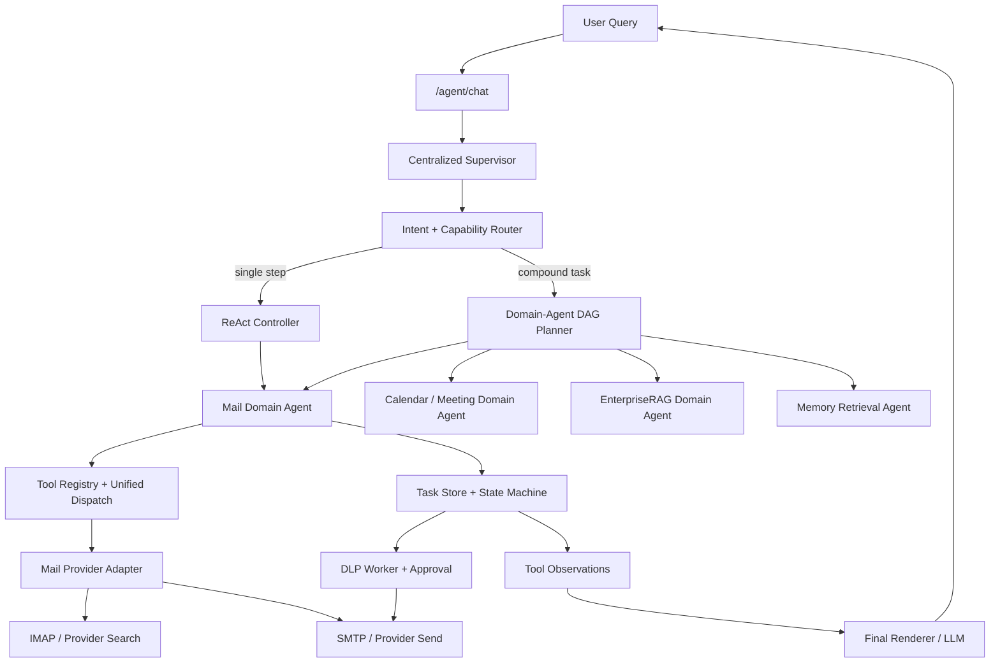
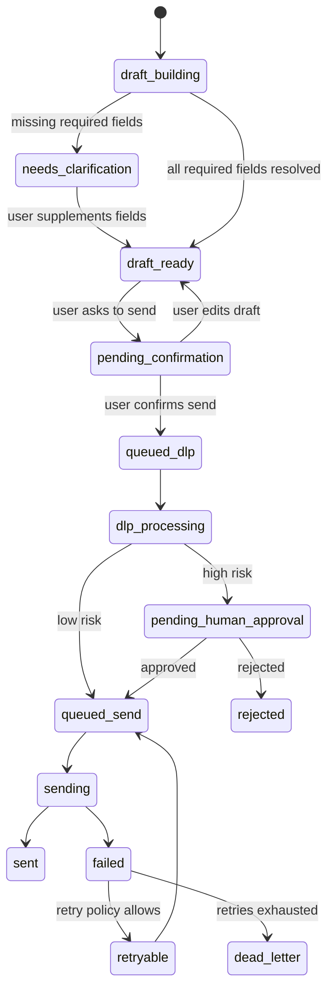
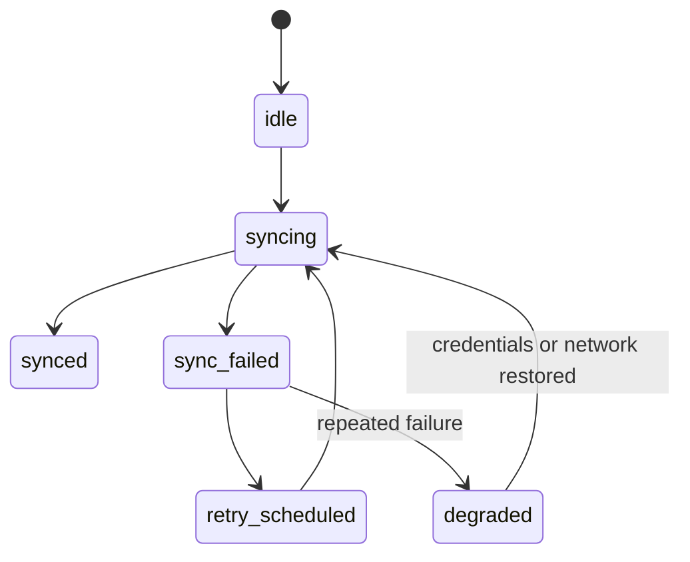
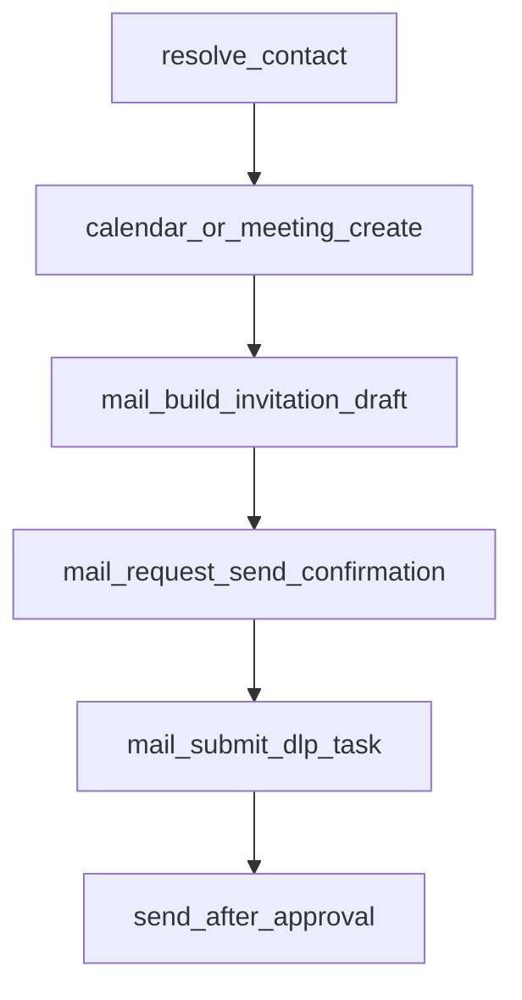

# Mail Agent V2 Engineering Spec

Status: draft v0.1
Owner: Enterprise mail / workflow agent iteration
Date: 2026-05-30

## 1. Background

当前项目已经具备一条可运行的邮件协作主链路：

- 入站邮件：通过 IMAP 同步邮件，写入 `inbound_mail_messages`，支持摘要、列表、读取和回复草稿。
- 出站邮件：通过 `/agent/chat` 解析用户请求，生成 `mail_plan`，再进入 DLP 检测、人工确认、SMTP 发送。
- 治理状态机：`dlp_tasks / dlp_task_events / dlp_task_approvals` 记录任务状态、审批事件和发送结果。
- 工具编排：已有 decorator-driven tool discovery、unified dispatch、DAG executor、confirmation guardrail。
- 跨域能力：会议预约已经通过 domain-agent / MCP provider 接入，并能生成会议邀请草稿。

V2 的目标不是重写这些能力，而是把现有碎片收束成一个面向企业真实场景的 Mail Domain Agent：

- 邮件读写能力从“几个接口”升级为稳定的领域能力。
- 邮件草稿、审批、发送、失败恢复形成统一状态机。
- HTML / plain text、thread、label、attachment、provider metadata 成为显式数据结构。
- 工具调用、权限、确认、观测、回放都能被 harness 验证。
- UI 只展示状态与观察结果，最终用户可见语言仍由 LLM 基于 observations 组织。

## 2. Non-Negotiable Constraints

本 spec 必须遵循 `总体要求.md`：

- 所有运行与验收只以 Docker 容器内结果为准。
- 不用大型业务 `if/else` 硬编码用户问法；意图与工具选择优先由 function calling / structured planning 完成。
- 代码负责工具能力、状态、约束、权限和来源边界；普通回答、澄清、草稿由 LLM 基于 observations 生成。
- side-effectful 工具必须经过权限、确认和 DLP 边界，不能被 MCP 或 dispatch 直接绕过。
- 修复坏 case 时优先修结构化中间层，不用固定输出模板修用户可见文本。
- 方案按长期可演进系统设计，不做 demo / POC 心态。
- 需要体现 harness engineering：回归脚本、失败注入、可观测指标、状态回放、并发压力保护。

## 3. Scope

### 3.1 V2 Core Scope

第一阶段建议只把邮件主链路做硬：

- 搜索 / 读取新邮件
- 线程级阅读与摘要
- 起草新邮件、回复、转发
- HTML 与 plain text 双格式处理
- label / mailbox / thread metadata 归一化
- attachment metadata 与来源边界
- DLP 检测、人工审批、真实发送
- pending draft 的编辑、补字段、确认发送
- 失败恢复、重试、dead letter、任务追踪

### 3.2 Cross-Domain Scope

保留跨域协作，但不让它吞掉邮件主线：

- Calendar / 腾讯会议用于“预约会议 + 生成邮件邀请”。
- EnterpriseRAG 用于“基于企业知识起草邮件内容”。
- Memory 用于“读取用户偏好、任务上下文、历史摘要”，但高风险记忆不得自动改变发送策略。

### 3.3 Deferred Scope

`邮件agent路线参考.md` 提到了 Docs / Sheets / Slides / Drive / Forms。方向正确，但建议不要全部并入 Mail V2 第一阶段。

第一阶段只保留最小边界：

- Drive / Docs 可作为附件来源或导出来源。
- Sheets / Slides / Forms 暂时作为未来 domain agent，不作为 Mail V2 必需能力。
- 如果用户明确要求“把邮件内容生成成文档 / 表格 / 表单”，由 Supervisor 分解为独立 domain-agent DAG，而不是塞进 Mail Agent 内部。

原因：邮件 Agent 的核心难点是外发治理和状态一致性；办公套件 CRUD 是另一个产品面。如果一轮同时做，会增加状态机、权限、UI、provider adapter、测试矩阵的复杂度。

## 4. Current Baseline Mapping

### 4.1 Existing Files

- `app/inbound_mail.py`：IMAP 同步、MIME 文本抽取、入站摘要、回复草稿。
- `app/inbound_mail_store.py`：入站邮件、同步状态、通知 outbox 的 PostgreSQL 存储。
- `app/outbound_delivery.py`：用户请求解析为 `mail_plan`，包括收件人、正文、附件、来源策略、确认状态。
- `app/task_store.py`：DLP 任务、事件、审批记录。
- `app/task_worker.py`：DLP 风险评估、审批后发送、入站同步 worker。
- `app/orchestration/tool_discovery.py`：动态工具注册、dispatch、side-effectful 拦截。
- `app/orchestration/tools/orchestration_tools.py`：入站 / 出站邮件 summary、搜索、读取、回复草稿工具。
- `app/orchestration/tools/mail_workflow_tools.py`：会议邀请邮件草稿状态生成。
- `app/main.py`：`/agent/chat` 入口，处理 pending confirmation、pending draft patch、mail action plan、DLP task 创建。

### 4.2 Existing Strengths

- 已有真实 DLP + approval + send 闭环。
- 已有入站同步和本地可检索邮件存储。
- 已有动态工具 registry 与 side-effectful guardrail。
- 已有 DAG executor，可表达 meeting -> mail draft 这种依赖关系。
- 已有任务事件表，适合做恢复、审计和 UI timeline。

### 4.3 Existing Gaps

- 邮件域模型还散在 `mail_plan`、DLP task、inbound store、UI state 中。
- HTML 邮件只提取 visible text，尚未形成 `body_html_sanitized / body_text / body_preview` 双格式结构。
- thread、label、mailbox、provider message id 尚未规范化成稳定 schema。
- 入站 read/search 主要基于本地同步结果，缺少 provider-native search adapter 边界。
- 出站草稿状态与 DLP task 状态有重叠，需要统一状态机。
- 部分中文字符串存在编码异常，后续应集中清理。
- `邮件agent路线参考.md` 引用 `spec/AGENT_UI_SPEC.md`，但当前工作树实际文件名是 `spec/AGENT_UI_SPEC copy.md`，需要确认是否重命名。

## 5. Target Architecture



关键原则：

- Supervisor 不直接写邮件正文，只决定任务分解与工具路径。
- Mail Domain Agent 只产出结构化 observations、draft state、task state。
- Provider Adapter 只负责和 IMAP / SMTP / Calendar / future provider API 交互。
- Final Renderer 根据 observations 组织用户可见回答、澄清、草稿预览。
- 发送永远走 DLP + confirmation + task state，不允许工具直接发送。

## 6. Domain Model

### 6.1 MailAccount

表示一个可访问的邮箱身份。

字段建议：

- `account_id`：内部账号 ID。
- `provider`：`imap_smtp | google_workspace | exchange | tencent_enterprise_mail | mock`。
- `email_address`：邮箱地址。
- `display_name`：发信展示名。
- `capabilities`：支持能力，如 `search`, `labels`, `threads`, `html`, `attachments`, `send`.
- `auth_ref`：凭据引用，不直接暴露 secret。
- `status`：`active | disabled | auth_expired`.

### 6.2 MailMessage

表示一封邮件的规范化形态。

字段建议：

- `message_id`：内部稳定 ID。
- `provider_message_id`：服务商原始 message id。
- `thread_id`：归一化线程 ID。
- `mailbox`：如 `INBOX`, `Sent`, `Archive`。
- `labels`：归一化 label 列表。
- `sender` / `recipients` / `cc` / `bcc`
- `subject`
- `received_at` / `sent_at`
- `snippet`
- `body_text`
- `body_html_sanitized`
- `body_preview`
- `attachments`
- `headers_json`
- `risk_hint`
- `is_seen`
- `source_policy`

### 6.3 MailThread

表示邮件会话，而不是单封邮件。

字段建议：

- `thread_id`
- `provider_thread_id`
- `subject_normalized`
- `participants`
- `message_ids`
- `last_message_at`
- `unread_count`
- `labels`
- `summary`
- `open_actions`

### 6.4 MailDraft

表示用户可编辑、可确认、可进入 DLP 的草稿。

字段建议：

- `draft_id`
- `conversation_id`
- `draft_kind`：`new_message | reply | forward | meeting_invitation | rag_grounded_mail`
- `status`
- `to` / `cc` / `bcc`
- `subject`
- `body_text`
- `body_html`
- `attachments`
- `source_refs`
- `body_sources`
- `source_policy`
- `missing_fields`
- `requires_confirmation`
- `requires_dlp`
- `created_from_observations`
- `last_patch_request`

### 6.5 MailOperationTask

表示真实副作用动作的状态。

字段建议：

- `task_id`
- `task_type`：`mail_send | mail_reply | mail_forward | mail_label_update | mail_sync`
- `draft_id`
- `status`
- `dlp_task_id`
- `provider_operation_id`
- `idempotency_key`
- `attempt_count`
- `last_error`
- `created_at` / `updated_at`

### 6.6 MailObservation

工具返回给编排层和最终渲染器的结构化观察。

字段建议：

- `observation_type`
- `source_tool`
- `summary`
- `entities`
- `message_refs`
- `thread_refs`
- `draft_ref`
- `task_ref`
- `risk`
- `missing_fields`
- `next_actions`
- `debug`

## 7. Tool Manifest

V2 工具应全部走 `@register_tool`，并暴露清晰 manifest。下面是建议集合。

### 7.1 Read-Only Tools

`mail_search_messages`

- 作用：按关键词、发件人、时间、label 搜索同步邮件或 provider 邮件。
- 输入：`query`, `sender`, `since`, `until`, `labels`, `limit`.
- 输出：`mail_search` observation。
- 安全：read-only。

`mail_read_message`

- 作用：读取单封邮件。
- 输入：`message_id`.
- 输出：`mail_message` observation。
- 安全：read-only。

`mail_list_threads`

- 作用：按时间、label、参与人列出线程。
- 输入：`query`, `participant`, `labels`, `limit`.
- 输出：`mail_thread_list` observation。
- 安全：read-only。

`mail_read_thread`

- 作用：读取一个线程的消息列表与摘要。
- 输入：`thread_id`.
- 输出：`mail_thread` observation。
- 安全：read-only。

`mail_summarize_thread`

- 作用：基于线程 messages 生成结构化摘要 observation。
- 输入：`thread_id`, `summary_goal`.
- 输出：`mail_thread_summary` observation。
- 安全：read-only；用户可见总结由 final renderer 生成。

`mail_get_provider_health`

- 作用：查看同步状态、最近错误、认证状态。
- 输入：`account_id`.
- 输出：`mail_provider_health` observation。
- 安全：read-only。

### 7.2 Draft Tools

`mail_build_send_draft`

- 作用：构造新邮件草稿状态。
- 输入：`to`, `subject_hint`, `content_goal`, `source_refs`, `attachments`.
- 输出：`mail_draft` observation。
- 安全：read-only；不发送。

`mail_build_reply_draft`

- 作用：基于 message/thread 构造回复草稿状态。
- 输入：`message_id | thread_id`, `reply_goal`, `source_refs`.
- 输出：`mail_draft` observation。
- 安全：read-only；不发送。

`mail_build_forward_draft`

- 作用：构造转发草稿。
- 输入：`message_id | thread_id`, `to`, `forward_goal`.
- 输出：`mail_draft` observation。
- 安全：read-only；不发送。

`mail_patch_draft`

- 作用：根据用户补充修改 pending draft 的结构化字段。
- 输入：`draft_id`, `patch_instruction`.
- 输出：`mail_draft_patch` observation。
- 安全：read-only；不发送。

### 7.3 Side-Effectful Tools

`mail_request_send_confirmation`

- 作用：将草稿推进到待确认状态。
- 输入：`draft_id`.
- 输出：`mail_confirmation_required` observation。
- 安全：requires_confirmation。

`mail_submit_dlp_task`

- 作用：确认后把草稿提交到 DLP workflow。
- 输入：`draft_id`, `confirmation_payload`.
- 输出：`dlp_task_state` observation。
- 安全：side_effectful，requires_confirmation。

`mail_apply_label`

- 作用：给邮件或线程加 label。
- 输入：`message_id | thread_id`, `label`.
- 输出：`mail_label_update` observation。
- 安全：side_effectful，requires_confirmation 可按企业策略配置。

`mail_archive_thread`

- 作用：归档线程。
- 输入：`thread_id`.
- 输出：`mail_thread_update` observation。
- 安全：side_effectful，requires_confirmation 可按策略配置。

`mail_sync_inbound`

- 作用：触发邮箱同步。
- 输入：`mailbox`, `since`, `limit`.
- 输出：`mail_sync_state` observation。
- 安全：mutating local cache，但不是外部发送；可设置为 internal side effect。

### 7.4 MCP Exposure Policy

- read-only 工具可以 `expose_mcp=True`。
- 草稿工具可以暴露，但必须只返回 draft state。
- 真实发送、label 修改、归档等副作用工具默认不暴露，或暴露后必须返回 `confirmation_required`。
- MCP JSON-Lines / JSON-RPC 调用都不应绕过 `dispatch_tool_call`。

## 8. State Machines

### 8.1 Draft State Machine



### 8.2 Provider Sync State



### 8.3 DAG Relation

复合任务示例：“帮我约明天下午和张三的腾讯会议，并发邮件邀请他”。



并行性：

- `resolve_contact` 与 `EnterpriseRAG context fetch` 可并行。
- `mail_build_invitation_draft` 必须依赖会议创建结果。
- `mail_submit_dlp_task` 必须依赖用户确认。
- `send_after_approval` 必须依赖 DLP 结果。

## 9. Provider Adapter Design

### 9.1 Interface

建议新增 `app/mail/provider_base.py`：

```python
class MailProvider(Protocol):
    def search_messages(self, request: MailSearchRequest) -> MailSearchResult: ...
    def read_message(self, message_id: str) -> MailMessage: ...
    def list_threads(self, request: ThreadListRequest) -> ThreadListResult: ...
    def read_thread(self, thread_id: str) -> MailThread: ...
    def sync_mailbox(self, request: SyncRequest) -> SyncResult: ...
    def send_message(self, request: SendMailRequest) -> SendMailResult: ...
    def apply_label(self, request: LabelRequest) -> LabelResult: ...
```

第一版 provider：

- `imap_smtp_provider`：对接当前 IMAP / SMTP。
- `local_store_provider`：用于已同步邮件的 read/search。
- `fake_provider`：用于 Docker regression 与 harness。

后续 provider：

- `google_workspace_provider`
- `exchange_provider`
- `tencent_enterprise_mail_provider`

### 9.2 Adapter Boundary

Provider adapter 只返回结构化结果，不生成用户可见话术。

Provider adapter 不决定是否发送；发送请求必须来自状态机确认后的 send task。

Provider adapter 不直接写 memory；memory 由 orchestration 层根据 observation 和 policy 决定。

## 10. HTML / Plain Text Strategy

### 10.1 Inbound

当前实现会优先提取 `text/plain`，没有 plain 时从 HTML 提取 visible text。V2 建议改成双格式：

- `body_text`：可供 LLM 和 DLP 使用的纯文本。
- `body_html_sanitized`：可供 UI 展示的净化 HTML。
- `body_preview`：列表页短摘要。
- `html_sanitization_status`：`not_html | sanitized | stripped | failed`.

安全要求：

- 不保存可执行脚本。
- 不在 UI 直接渲染未经净化的 HTML。
- DLP 默认扫描 `body_text + subject + attachment text preview`。

### 10.2 Outbound

出站草稿同时维护：

- `body_text`：DLP 与纯文本 fallback。
- `body_html`：富文本发送版本。
- `body_format`：`plain | html | multipart`.

第一阶段建议：

- UI 可以先展示 plain text。
- SMTP 发送可先保持 plain text。
- 如果需要 HTML，必须有 sanitized preview 与 text fallback。

## 11. Labels, Threads, and Mailboxes

### 11.1 Labels

设计两层 label：

- `provider_label_id`：服务商原始 label。
- `normalized_label`：系统统一 label，如 `inbox`, `sent`, `important`, `archive`, `needs_reply`.

如果 provider 不支持 label：

- 使用本地 label store，不回写 provider。
- observation 中标明 `provider_write_supported=false`。

### 11.2 Threads

thread 归一化优先级：

1. provider thread id
2. `In-Reply-To` / `References` headers
3. normalized subject + participants + time window fallback

thread summary 不直接写入企业知识库，除非用户明确把它作为知识文档导入。

## 12. Privacy and Governance

### 12.1 DLP Boundary

所有真实发送必须满足：

- draft 已生成并可追溯来源。
- 用户显式确认。
- DLP 已扫描。
- 高风险时进入人工审批。
- 审批通过后才允许发送。
- 发送结果写入 task event。

### 12.2 Memory Boundary

邮件正文和附件内容不得默认进入长期用户画像。

允许进入 memory 的内容：

- 用户偏好：如“以后给客户邮件用正式语气”。
- 任务摘要：如“用户正在处理某客户的合同邮件”。
- 发送记录摘要：不包含敏感正文。

高风险偏好或策略变更必须进入 `pending`，不能自动改变工具权限、DLP 策略或发送默认行为。

### 12.3 Source Policy

草稿必须记录内容来源：

- `user_explicit_only`
- `summarize_only`
- `attachment_only`
- `enterprise_rag_grounded`
- `meeting_result_only`

Final renderer 可以把这些来源解释给用户，但不能把来源策略替换成业务结果。

## 13. Concurrency and Reliability

参考 `spec/Orchestration Patterns for Concurrent .md`，Mail V2 需要落地以下工程机制。

### 13.1 Cost Router

根据任务类型选择快慢路径：

- 快路径：收件箱摘要、读取已同步邮件、状态查询。
- 慢路径：复杂草稿、多工具 DAG、RAG grounding、DLP 检测。

### 13.2 Budget Allocator

每个请求生成执行预算：

- max tool calls
- max parallel reads
- max LLM tokens
- max provider calls
- max retry count
- deadline

预算不足时返回结构化 observation，由 final renderer 向用户说明需要缩小范围或继续执行。

### 13.3 Backpressure

已有 `app/backpressure.py` 与 queue health 基础。V2 应用于：

- 邮件同步任务限流。
- DLP worker 积压时延迟发送队列。
- provider API 失败率升高时降级到 local cache。
- 同一 conversation 的 pending draft 操作串行化。

### 13.4 Shared State and Conflict Resolution

共享状态建议使用 blackboard：

- `contact_resolution`
- `mail_draft_state`
- `meeting_result`
- `rag_context`
- `dlp_task_state`

冲突规则：

- 用户最新显式修改覆盖旧 draft 字段。
- provider 返回的 message id 覆盖本地临时 id。
- DLP 结果不能被 LLM 覆盖。
- 权限拒绝不能被 planner 改写成成功。

### 13.5 Checkpoint and Recovery

所有副作用前都要 checkpoint：

- pending draft
- pending confirmation
- queued dlp
- pending approval
- queued send
- provider operation result

恢复策略：

- 如果 worker 崩溃，按 `task_id` 继续。
- 如果 provider send 超时，使用 `idempotency_key` 查询或避免重复发送。
- 如果多次失败，进入 dead letter queue。

### 13.6 Dead Letter Queue

DLQ 记录：

- `task_id`
- failed action
- last payload digest
- last error
- attempts
- recovery hint
- safe replay allowed

UI 可展示“失败任务可恢复”，但是否 replay 仍需用户或管理员确认。

## 14. UI Requirements

当前 `邮件agent路线参考.md` 要求严格遵循 `spec/AGENT_UI_SPEC.md`，但工作树中实际文件是 `spec/AGENT_UI_SPEC copy.md`。这需要先确认文件名与内容。

Mail V2 UI 建议包含：

- Inbox / thread list：展示同步邮件、未读、重要邮件、风险提示。
- Thread detail：展示消息、摘要、可回复操作。
- Draft review：展示收件人、主题、正文、附件、来源、缺失字段。
- DLP task panel：展示风险等级、命中项、审批状态、发送状态。
- Workflow timeline：展示 tool observations、状态迁移、失败恢复入口。
- Provider health：展示 IMAP/SMTP 同步状态、最近错误、队列积压。

UI 原则：

- UI 展示状态和 observations。
- UI 不拼接最终话术。
- UI 不提供绕过 DLP / confirmation 的发送按钮。
- 调试信息和用户主回答分层展示。

## 15. Data Storage Plan

### 15.1 Existing Tables

`inbound_mail_messages`

- 已有字段：`message_id`, `mailbox`, `uid`, `sender`, `recipients`, `subject`, `received_at`, `snippet`, `summary`, `risk_hint`, `raw_size`, `is_seen`, `created_at`, `updated_at`.
- 建议扩展：`provider_message_id`, `thread_id`, `labels_json`, `body_text`, `body_html_sanitized`, `headers_json`, `attachments_json`.

`mail_sync_state`

- 已有字段：`mailbox`, `last_seen_uid`, `last_sync_at`, `last_error`, `updated_at`.
- 建议扩展：`account_id`, `provider`, `cursor_json`, `status`, `attempt_count`.

`dlp_tasks`

- 已承担出站治理主表。
- 建议保留，并通过 `domain_payload` / `draft_id` 与 MailDraft 关联。

`dlp_task_events`

- 可作为 workflow timeline 基础。

`dlp_task_approvals`

- 可作为人工审批审计基础。

### 15.2 Proposed Tables

`mail_threads`

- 存 thread 级聚合信息和摘要。

`mail_drafts`

- 存 pending draft、patch history、source policy。

`mail_operation_tasks`

- 存 provider 操作、重试、idempotency、DLQ 状态。

`mail_labels`

- 存 provider label 与 normalized label 映射。

是否新增表可分阶段：

- M1 可先扩展现有表 + `domain_payload`。
- M2 再独立 `mail_drafts / mail_threads`，避免第一天迁移过重。

## 16. Observability and Harness Engineering

### 16.1 Metrics

建议新增或稳定：

- `mail_sync_success_total`
- `mail_sync_failure_total`
- `mail_provider_latency_seconds`
- `mail_draft_created_total`
- `mail_confirmation_required_total`
- `mail_dlp_blocked_total`
- `mail_send_success_total`
- `mail_send_failure_total`
- `mail_dead_letter_total`
- `mail_tool_dispatch_total`
- `mail_tool_dispatch_failure_total`

### 16.2 Regression Harness

所有命令在 Docker 内执行：

- compile：`python -m compileall -q app scripts mcp`
- tool registry：动态工具数不低于迁移前，mail tools 均有 manifest。
- read-only mail：搜索、读取、线程摘要 smoke。
- draft：send/reply/forward draft 生成、patch、missing fields。
- DLP：低风险自动入发送队列，高风险进入审批。
- confirmation：未确认不发送，确认后才提交 DLP。
- side-effect guard：MCP / dispatch 默认拒绝直接发送。
- HTML/plain：HTML 输入净化后生成 text，plain fallback 存在。
- labels/thread：provider 支持与不支持两种路径。
- failure recovery：provider send timeout、worker crash、retry exhausted、DLQ。
- concurrency：多用户、多 draft、多 sync、多 DLP 队列积压。

### 16.3 Fault Injection

需要构造：

- IMAP auth expired
- SMTP timeout
- provider duplicate send uncertainty
- DLP model failure
- policy store corrupted
- approval task missing
- user edits stale draft
- two requests modify same draft

## 17. Milestones and Time Estimate

### M0: Spec and Provider Decision

预估：0.5 到 1 天。

输出：

- 确认 Mail V2 scope。
- 确认 provider 优先级。
- 确认 UI spec 文件名。
- 确认 HTML / labels / thread 的第一阶段深度。

### M1: Mail Domain Model and Tool Contracts

预估：2 到 3 天。

输出：

- `MailMessage / MailThread / MailDraft / MailObservation` schema。
- mail tools 全部注册到 tool discovery。
- 现有 inbound/outbound 能力迁移到 manifest 化工具。
- Docker compile 和 registry regression 通过。

### M2: HTML / Thread / Label / Attachment Normalization

预估：3 到 5 天。

输出：

- MIME 解析升级为 text + sanitized HTML。
- thread id 归一化。
- label 映射。
- attachment metadata 标准化。
- 入站搜索与读取返回完整 observation。

### M3: Unified Draft and DLP State Machine

预估：3 到 4 天。

输出：

- pending draft 独立存储。
- patch draft 结构化。
- send confirmation -> DLP -> approval -> send 状态统一。
- task events 可回放。

### M4: Reliability and Harness

预估：3 到 5 天。

输出：

- retry / idempotency / DLQ。
- provider failure injection。
- queue/backpressure regression。
- Prometheus metrics。

### M5: UI Integration

预估：3 到 5 天。

输出：

- Inbox / thread / draft review / DLP timeline / provider health。
- 与 `AGENT_UI_SPEC.md` 对齐。
- 用户主回答与 debug/trace 分层。

### Provider Expansion

预估：5 到 10 天每个真实 provider，取决于认证与 API 权限。

候选：

- Tencent 企业邮箱 / 腾讯会议 / 日历。
- Google Workspace。
- Exchange / Microsoft Graph。

## 18. Acceptance Criteria

### 18.1 Functional

- 用户能问“今天有什么重要邮件”，系统读取已同步邮箱并给出摘要。
- 用户能指定一封邮件，系统读取 thread 并起草回复。
- 用户能要求“帮我发给某人”，系统生成 draft，展示待确认状态。
- 未确认时不会发送。
- 确认后进入 DLP。
- 高风险进入人工审批。
- 审批通过后真实发送。
- 发送失败可恢复或进入 DLQ。

### 18.2 Architecture

- 新增邮件能力通过 `@register_tool` 注册，不改核心路由大 if/else。
- side-effectful 工具默认不能被 MCP / dispatch 直接执行。
- final answer / draft preview 由 LLM 基于 observations 生成。
- 状态机和工具结果可被回放、测试和监控。

### 18.3 Data

- 邮件 message/thread/draft/task 都有稳定 ID。
- HTML 和 plain text 有明确边界。
- attachment 和 body source 有 provenance。
- 敏感正文不默认进入长期 memory。

### 18.4 Docker

- 所有 regression 在 Docker 内运行。
- 不以本机 Python 作为完成标准。

## 19. Open Decisions for Brainstorming

### Decision 1: Provider Priority

需要确认第一阶段主 provider：

- 选项 A：沿用当前 IMAP + SMTP，先把工程骨架做硬。
- 选项 B：优先接腾讯企业邮箱 / 腾讯会议生态，故事更统一。
- 选项 C：做 provider abstraction + fake provider，真实 provider 后接。

建议：A + C。先用现有 IMAP/SMTP 和 fake provider 跑通架构，再接腾讯或 Google provider。

### Decision 2: Docs / Drive / Forms 是否进入本轮

需要确认：

- 只作为附件来源和未来 domain agent？
- 还是本轮就做 Docs/Sheets/Slides/Forms CRUD？

建议：本轮不把办公套件 CRUD 纳入 Mail V2 core。它们可以作为下一轮“Workspace Agent”。

### Decision 3: HTML 深度

需要确认：

- 第一阶段只做 sanitized display + plain send？
- 还是直接支持 rich HTML authoring + multipart send？

建议：先做 sanitized inbound + plain outbound，保留 multipart 字段。HTML authoring 等 UI 稳定后再开。

### Decision 4: Label Source of Truth

需要确认：

- label 以 provider 为准？
- 还是本地 normalized label 为准？

建议：双层设计。provider 支持时回写 provider；不支持时本地 label 生效并明确 `provider_write_supported=false`。

### Decision 5: UI Spec File

当前引用 `spec/AGENT_UI_SPEC.md`，但实际文件为 `spec/AGENT_UI_SPEC copy.md`。

需要确认：

- 是否重命名为 `AGENT_UI_SPEC.md`？
- 还是另写正式 UI spec？

建议：另写正式 `spec/AGENT_UI_SPEC.md`，不要让 copy 文件成为长期契约。

### Decision 6: Memory 和 Mail 的边界

需要确认：

- 发送记录摘要是否写入 memory？
- thread summary 是否进入 conversation memory？
- 哪些内容必须 pending？

建议：任务摘要可以进 memory；邮件正文、附件正文、高风险偏好默认不进 active memory。

### Decision 7: 并发治理优先级

需要确认第一批做哪三个：

- backpressure
- idempotency
- DLQ
- checkpoint replay
- cost router
- budget allocator

建议：优先 `idempotency + checkpoint + DLQ`，因为它们直接关系到“不能重复发邮件”。

## 20. Recommended Next Implementation Order

1. 修正 UI spec 文件契约，明确 `AGENT_UI_SPEC.md`。
2. 新增 Mail V2 schema / domain model，不改变业务行为。
3. 把现有入站 / 出站工具迁移成 Mail V2 manifest。
4. 引入 `mail_drafts` 或等价 draft persistence。
5. 统一 draft -> confirmation -> DLP -> send 状态机。
6. 增加 fake provider 与 Docker regression。
7. 扩展 HTML / thread / label。
8. 增加 failure recovery 和 DLQ。
9. 再接真实 provider 扩展或 UI 深化。

## 21. Decision Matrix for Discussion

本节用于和用户确认细节。它不是新的需求清单，而是把 Mail Agent V2 中最容易扩大范围、影响工期或影响架构故事的点提前摊开。

### 21.1 Provider Strategy

推荐默认方案：`Current IMAP/SMTP + Fake Provider Harness + Provider Abstraction`

| 方案 | 优点 | 风险 | 工期影响 |
| --- | --- | --- | --- |
| 继续使用当前 IMAP/SMTP | 复用现有代码，最快形成稳定主线 | provider 能力有限，thread/label 能力可能不足 | 最低 |
| 直接接腾讯企业邮箱/日历 | 故事与腾讯会议更统一，更像企业集成 | 认证、API 权限、文档差异会拉长周期 | 中到高 |
| 直接接 Google Workspace | Docs/Drive/Calendar/Mail 生态完整 | 国内环境、OAuth、API quota、账号配置复杂 | 高 |
| 先做 provider abstraction + fake provider | harness 强，后续 provider 可替换 | 第一眼看起来没有“新 provider 亮点” | 中 |

建议落点：

- M1 用现有 IMAP/SMTP 保持真实链路。
- 同时加 fake provider，专门用于并发、失败恢复、重复发送防护测试。
- provider abstraction 先固定接口，不急着做所有真实 provider。

面试表达：

- “我没有把邮件能力绑死在某个 API，而是把 provider 交互隔离到 adapter；核心状态机、DLP、审批和幂等发送逻辑不依赖具体厂商。”

### 21.2 Mail Agent 与 Workspace Agent 的边界

推荐默认方案：`Mail Agent 做外发治理主线，Docs/Drive/Forms 作为独立 domain agents`

| 能力 | 放入 Mail V2 Core | 作为独立 Workspace Agent |
| --- | --- | --- |
| 邮件搜索/读取/回复/发送 | 是 | 否 |
| HTML/plain、thread、label | 是 | 否 |
| Drive 文件作为附件来源 | 是，最小集成 | 可深化 |
| Docs/Sheets/Slides CRUD | 否 | 是 |
| Forms 创建和回收 | 否 | 是 |

建议落点：

- Mail Agent 只关心“把什么内容、以什么来源、发给谁、是否安全、是否确认、是否已发送”。
- 文档协作工具由 Workspace Agent 负责，Mail Agent 只引用它们产出的 observation 或 attachment ref。

面试表达：

- “我把邮件外发治理和办公套件 CRUD 分成两个 domain agent，避免一个 agent 同时承担发送副作用、文档编辑和表单运营，导致权限与状态边界混乱。”

### 21.3 HTML Capability Depth

推荐默认方案：`Inbound sanitized HTML + outbound plain text first`

| 深度 | 内容 | 风险 | 工期影响 |
| --- | --- | --- | --- |
| Level 1 | 入站 HTML 转 visible text，出站 plain text | 富文本体验弱 | 低 |
| Level 2 | 入站保存 sanitized HTML，出站 plain + HTML preview | 需要净化器和 UI 预览 | 中 |
| Level 3 | multipart rich HTML authoring | 需要富文本编辑、样式约束、DLP HTML 扫描 | 高 |

建议落点：

- M2 做 Level 2。
- DLP 扫描以 `body_text` 为主，HTML 仅用于 UI 展示或发送包装。
- 发送 multipart 前必须保证 text fallback。

面试表达：

- “HTML 邮件不能直接进 UI 渲染，我会先做 sanitized HTML 与 plain text 双轨存储，DLP 使用纯文本视图，UI 使用净化后的展示视图。”

### 21.4 Thread and Label Source of Truth

推荐默认方案：`provider-native if available, local normalized fallback`

设计：

- `provider_thread_id` / `provider_label_id` 保留厂商原始语义。
- `thread_id` / `normalized_label` 供系统统一使用。
- provider 支持回写时执行 provider write。
- provider 不支持时只更新本地状态，并在 observation 中声明能力限制。

需要讨论：

- label 修改是否算高风险副作用？
- archive / mark read 是否需要确认？
- 是否允许用户批量 label 多封邮件？

建议落点：

- `send/reply/forward` 必须确认。
- `archive/delete/bulk label` 默认确认。
- `mark read / local label` 可按低风险策略不确认，但必须有审计事件。

### 21.5 State Machine Strictness

推荐默认方案：`严格治理发送链路，轻量治理读取链路`

| 链路 | 状态机强度 |
| --- | --- |
| read/search/summary | 轻量 observation 即可 |
| draft/patch | 需要 draft state |
| confirmation | 必须持久化 |
| DLP/approval/send | 必须完整 task state |
| provider write/delete/archive | 至少 operation task + audit event |

建议落点：

- 读操作不要过度状态机化，避免系统变慢。
- 发送类动作必须完整状态机化，避免重复发送、绕过审批、无法恢复。

### 21.6 Memory Boundary

推荐默认方案：`task summary can persist, raw mail content cannot persist by default`

可写入 memory：

- 用户偏好：语气、署名习惯、常用收件人角色。
- 任务摘要：某次邮件任务的非敏感概要。
- 操作结果：已发送、被拒绝、等待审批等状态摘要。

默认不写入 active memory：

- 原始邮件正文。
- 原始附件正文。
- 高风险 DLP 命中内容。
- 可能改变企业策略的用户偏好。

需要讨论：

- 用户说“以后都自动发给张三”是否允许记忆？
- 用户说“以后遇到合同不用审批”必须 pending 还是直接拒绝？
- 发送记录保留多久？

建议落点：

- 发信默认行为、审批绕过、DLP 策略类偏好必须 pending 或拒绝。
- 普通写作风格偏好可 active。

### 21.7 Reliability Priority

推荐默认方案：`idempotency + checkpoint + DLQ first`

原因：

- 邮件系统最不能接受重复发送。
- 其次是发送状态丢失。
- 再其次是失败后无法解释和恢复。

第一批必做：

- `idempotency_key`：同一个确认请求不会重复发送。
- checkpoint：发送前持久化 task state。
- DLQ：多次失败后进入可人工恢复队列。

第二批再做：

- cost router。
- budget allocator。
- provider adaptive backoff。
- queue-level autoscaling。

### 21.8 UI Contract

推荐默认方案：新建正式 `spec/AGENT_UI_SPEC.md`

当前问题：

- 路线参考写的是 `spec/AGENT_UI_SPEC.md`。
- 工作树实际是 `spec/AGENT_UI_SPEC copy.md`。
- 文件名本身像临时复制件，不适合作为长期契约。

建议落点：

- 将 UI spec 独立整理为正式文件。
- Mail V2 spec 只引用正式 UI spec。
- UI spec 明确哪些是用户主回答、哪些是 debug/trace、哪些是审批操作区。

### 21.9 Recommended Defaults to Lock

如果希望尽快进入实现，可以先锁定这些默认值：

1. Provider：现有 IMAP/SMTP + fake provider harness。
2. Workspace：Docs/Drive/Forms 不进 Mail V2 core。
3. HTML：入站 sanitized HTML，出站先 plain text。
4. Label/thread：provider-native + local normalized fallback。
5. Send governance：所有真实发送必须 confirmation + DLP + task state。
6. Memory：任务摘要可写，原始正文和高风险内容不写 active memory。
7. Reliability：先做 idempotency、checkpoint、DLQ。
8. UI：新建正式 `spec/AGENT_UI_SPEC.md`。
