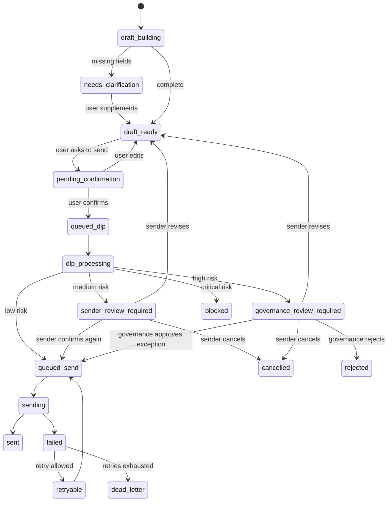
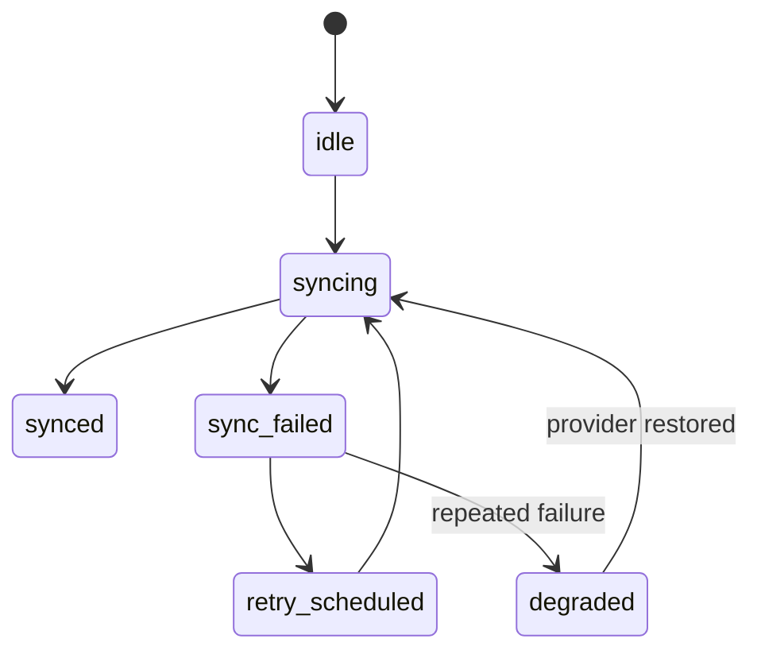

# Mail Agent State Machines

## Draft Lifecycle

## Provider Sync

## Confirmation Boundary

No external send can occur before `pending_confirmation -> queued_dlp`.

Confirmation must bind:

- `draft_id`
- `idempotency_key`
- `actor_context`
- `resolved recipients`
- `subject`
- `body_text`
- `attachments`
- `source_policy`

## DLP Boundary

DLP result cannot be overwritten by LLM output. The renderer may explain the result, but task state is the source of truth.

## Risk Routing

| Risk | Required action |
| --- | --- |
| `low` | Send after the initial explicit confirmation and DLP pass. |
| `medium` | Sender reviews the warning on `8511`, then revises, cancels, or confirms again. |
| `high` | Escalate to `8512` for governance exception approval or rejection. |
| `critical` | Block by default. Revise or cancel; no normal approval release. |

## Replay Boundary

Replay is allowed only from checkpointed states:

- `queued_dlp`
- `queued_send`
- `delivery_deferred`
- `dead_letter`

Replay requires idempotency checks before any provider call.
